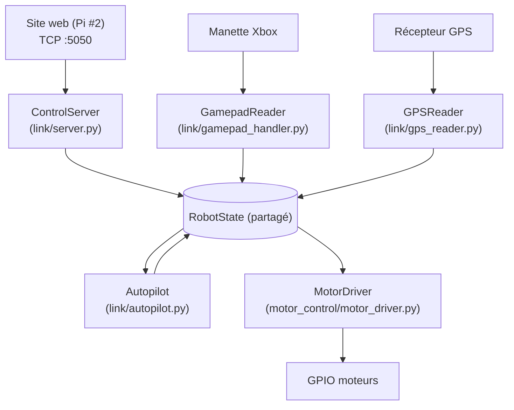

# Robot (Raspberry Pi 5)

Code embarqué sur la Raspberry Pi n°1 du projet : pilotage moteurs, télécommande,
asservissement PID et navigation GPS/DGPS pour un robot mobile d'extérieur.

Le serveur web (Flask, sur la Raspberry Pi n°2) qui envoie les ordres à ce robot
vit dans un dépôt séparé.

## Structure du projet

```
.
├── motor_control/      # Pilotage moteurs (GPIO/PWM) et entrée manette
│   ├── gpiochip.py             # Détection du gpiochip RP1 (partagée par motor_driver.py)
│   ├── motor_driver.py         # PWM logiciel + GPIO -- unique propriétaire des moteurs (voir plus bas)
│   ├── remote_control.py       # Pilotage manuel autonome (manette -> moteurs), utilisé par les 3 scripts ci-dessous
│   ├── gps_condition_logger.py       # Moteur commun aux 3 scripts ci-dessous (logique de journalisation GPS conditionnelle)
│   ├── gps_log_on_full_throttle.py   # Variante de remote_control.py : journalise le GPS en ligne droite a fond (reponse a l'echelon, translation)
│   ├── gps_log_on_full_rotation.py   # Variante de remote_control.py : journalise le GPS en rotation sur place a fond (reponse a l'echelon, rotation)
│   └── gps_log_on_full_maneuvers.py  # Variante de remote_control.py : les 2 ci-dessus a la fois, en un seul script/une seule lecture GPS
├── pid/                # Asservissement PID (distance / cap)
│   ├── pid_controller.py
│   ├── pid_plot.py               # Simulation/visualisation hors robot (ancien)
│   ├── simulate_pid.py           # Simulateur de réglage PID (1 boucle, coefficients réels)
│   └── simulate_motor_commands.py # Simulateur distance+angle -> commandes moteur PWM
├── gps/                # Lecture GPS, correction DGPS (NTRIP), calculs géo
│   ├── gps_parse.py
│   ├── gps_transfer.py
│   ├── dgps_transfer.py
│   └── gps_delta.py
├── link/               # Serveur TCP recevant les commandes du site web (voir plus bas)
│   ├── nmea.py         # Construction/analyse des trames + checksum
│   ├── robot_state.py  # Validation et état (PWM, mode, cible GPS, gains PID, appelle camera/ en HTTP pour CAM,SNAP, pilote motor_control/motor_driver.py et link/autopilot.py)
│   ├── autopilot.py    # Maths pures de navigation (distance, cap) + PID -> PWM pour le mode AUTO (voir plus bas)
│   ├── gps_reader.py   # Lecture GPS en tâche de fond (voir plus bas)
│   ├── gamepad_handler.py # Lecture manette (evdev), tâche de fond -- alimente le même RobotState que le TCP (voir plus bas)
│   └── server.py        # Serveur TCP (socketserver), démarre aussi motor_driver + gamepad_handler
├── camera/             # Flux caméra en direct + snapshots (voir plus bas) -- processus séparé de link/, relié par HTTP local
│   ├── stream_server.py
│   └── snapshots.py    # Stockage des snapshots, jamais plus de 5 fichiers
├── archive/            # Anciennes versions gardées pour référence (voir plus bas), dont pwm_2026.py (ancien motor_control/pwm.py, remplacé par motor_control/motor_driver.py)
├── tests/              # Tests automatisés (pytest)
├── run_robot.sh        # Lance link/server.py + camera/stream_server.py ensemble, arrêt propre des deux au Ctrl+C (voir plus bas)
├── requirements.txt
└── .env.example        # Modèle pour les identifiants NTRIP et de la caméra (voir plus bas)
```

## Installation

```bash
python3 -m venv venv
source venv/bin/activate
pip install -r requirements.txt
```

Certains modules nécessitent du matériel Raspberry Pi (`gpiod`, `evdev`) ou un
GPS branché en USB/série (`/dev/ttyACM0`) — ils ne peuvent être exécutés que sur
la Raspberry Pi n°1, pas sur un PC de développement classique.

## Configuration (identifiants NTRIP)

`gps/dgps_transfer.py` utilisait auparavant des identifiants NTRIP écrits en
dur dans le code. Ils sont maintenant lus depuis un fichier `.env` (jamais
commité, voir `.gitignore`) :

```bash
cp .env.example .env
# puis éditer .env si vous avez vos propres identifiants NTRIP
```

Sans fichier `.env`, le script retombe sur le compte public de test du réseau
Centipede (`crtk.net`), comme avant.

## Réglage des PID (hors robot)

Deux outils de simulation, sans matériel nécessaire :

```bash
# Comparer plusieurs jeux de coefficients sur une seule boucle
python3 pid/simulate_pid.py --y0 5 --setpoint 0 --kp 1 --ki 0 --kd 0,0.5,2 \
  --ylabel "Distance restante (m)"

# Voir l'effet combiné distance+angle sur les commandes moteur (left_speed/right_speed)
python3 pid/simulate_motor_commands.py --dist-kp 1 --dist-kd 0.5 --angle-kp 0.5 --angle-kd 1
```

Le second script reproduit exactement le mixage de `move_to_target()` (distance
+ angle -> `left_speed`/`right_speed`) et trace des lignes de repère à ±255
pour repérer visuellement une saturation — voir "Corrections apportées"
plus bas, deux problèmes réels ont été détectés puis corrigés grâce à cet outil.

Les coefficients par défaut dans `pid_controller.py`
(`pid_distance = PIDController(kp=1, ki=0, kd=0.5, ...)`,
`pid_angle = PIDController(kp=0.5, ki=0, kd=1, ...)`) sont ceux validés par ces
simulations (pas de dépassement ni de saturation moteur sur le modèle simulé).
Ils restent à confirmer sur le robot réel, à basse vitesse, avant un usage
complet en extérieur.

## Serveur de commandes (`link/`)

Reçoit les trames NMEA envoyées par le site web (Raspberry Pi n°2, voir
`pages/protocole_controle.html` dans le dépôt `robot-webserver` pour le
format complet des trames) et y répond par `ACK`/`ERR`/`STA`.

```bash
python3 -m link                                    # écoute sur 0.0.0.0:5050
CONTROL_HOST=0.0.0.0 CONTROL_PORT=5050 python3 -m link   # port personnalisé
```

État actuel de l'implémentation :

- `STP` (arrêt d'urgence) et `DRV` (pilotage direct) valident les entrées,
  mettent à jour un état en mémoire (`link/robot_state.py`) et pilotent
  pour de vrai les moteurs depuis le 2026-09-07, via
  `motor_control/motor_driver.py` (voir la section dédiée plus bas) —
  c'était le point explicitement laissé "à décider" dans une version
  précédente de ce README (refactoriser `pwm.py` en fonction appelable,
  ou faire cohabiter ce serveur avec l'ancien pipeline
  `dgps_transfer.py | pid_controller.py | pwm.py`) : c'est la première
  option qui a été retenue. L'ancien `motor_control/pwm.py` (script
  bloquant, GPIO ouvert dès l'import, boucle sur `stdin`) est archivé
  dans `archive/pwm_2026.py`.
- `MOD` (changement de mode -- `IDLE`/`MANUAL`/`AUTO`) a un effet réel
  immédiat sur les moteurs (voir plus bas) ; `PID` (gains `D`=distance ou
  `A`=angle) règle en direct les deux boucles PID que `link/autopilot.py`
  fait tourner pendant le pilotage `AUTO` -- utile pour ajuster les gains
  depuis la console pendant un test, sans redémarrer le serveur. `NAV`
  enregistre la cible et annule une éventuelle route `RTE` en cours (voir
  ci-dessous) — l'opérateur reprend la main.
- `RTE` (nouvelle trame, un champ `count` suivi de `count` points
  lat/lat_dir/lon/lon_dir, même format que `NAV`) enregistre une liste de
  points de passage ordonnée dans `link/robot_state.py`
  (`RobotState.route`/`route_index`) et arme le premier comme cible
  (`nav_target`). À chaque nouvelle position GPS (`update_gps_fix`), si la
  distance (haversine, `link/autopilot.py` — volontairement pas de
  réutilisation de `gps/gps_delta.py`, dont
  `distance_to_target_meter`/`angle_to_target_radius` référencent des
  variables non définies) entre la position courante et le point visé passe
  sous `ROUTE_ARRIVAL_RADIUS_M` (5 m par défaut, `float` réglable par
  variable d'environnement), la cible avance automatiquement au point
  suivant, jusqu'au dernier. `STP` et `NAV` annulent une route en cours.
  Depuis le 2026-09-07, en mode `AUTO`, le robot pilote vraiment vers
  `nav_target` à chaque fix GPS (voir la section "Pilotage moteur et
  manette" plus bas pour le détail et les limites) -- avant cette date,
  seul `nav_target`/le champ `target_*` de `STA` avançait, sans que les
  moteurs suivent. Limite : 200 points par route (`ROUTE_MAX_POINTS`).
  Voir `pages/protocole_controle.html` (dépôt `robot-webserver`) pour le
  format exact de la trame et le bouton "GPS route" de `/control` qui la
  génère depuis un fichier texte.
- `CAM,SNAP` appelle pour de vrai la route `GET /snap` de
  `camera/stream_server.py` (processus séparé, en HTTP local — voir section
  dédiée ci-dessous) et répond `ACK`/`ERR` selon que ça réussit ou non
  (caméra éteinte, pas encore de trame disponible...). `CAM,REC_START` et
  `CAM,REC_STOP` répondent toujours `ERR` (`CAM_NOT_IMPLEMENTED`) —
  l'enregistrement vidéo n'existe pas dans le projet à ce jour.
- `STA` (sans champ, en requête) répond avec l'état courant : position
  *courante* (`lat`/`lat_dir`/`lon`/`lon_dir`), `cap` et `speed` sont lus
  pour de vrai depuis un récepteur GPS série par `link/gps_reader.py` (voir
  section dédiée ci-dessous) — `0.0` tant qu'aucun récepteur n'est branché
  ou qu'aucune trame valide n'a été reçue. Position *cible*
  (`target_lat`/`target_lat_dir`/`target_lon`/`target_lon_dir`, dernière
  trame `NAV` reçue), `left_pwm`/`right_pwm` et `mode` sont réels dès
  aujourd'hui. `batterie` reste à 0 (aucun capteur de batterie dans le
  projet). Tout ça alimente le bandeau de statut et l'onglet "TCP" de
  `/control` sur le site web.

## Pilotage moteur et manette (`motor_control/motor_driver.py`, `link/gamepad_handler.py`)

Depuis le 2026-09-07, `link/server.py` démarre trois tâches de fond en plus
du serveur TCP lui-même, toutes alimentant/lisant le même `RobotState` (voir
schéma ci-dessous) :

- `motor_control/motor_driver.py` (`MotorDriver`) : unique propriétaire de
  la puce GPIO et du PWM logiciel des deux moteurs. Refactor de l'ancien
  `motor_control/pwm.py` (archivé, voir `archive/pwm_2026.py`) en classe
  réellement importable/réutilisable — c'était le point que ce README
  laissait explicitement "à décider" avant le 2026-09-07. `drive(left,
  right)` est un simple setter protégé par verrou (sûr à appeler depuis
  n'importe quel thread), la boucle PWM elle-même tourne dans un thread
  dédié.
- `link/gamepad_handler.py` (`GamepadReader`) : lit une manette Xbox via
  `evdev` (remplace `pygame`, plus fiable en headless -- voir le
  docstring du module) et appelle directement `RobotState.drive()` (stick
  gauche/droit) et `RobotState.set_mode()` (boutons) -- la manette et les
  trames TCP du site web sont deux entrées symétriques du même état, ni
  l'une ni l'autre ne touche au GPIO directement.
- Boutons de la manette (voir `robot_state_button_handler()`) : `A` arme
  le mode `AUTO` (c'est le bouton "vas-y jusqu'au point suivant" physique
  -- voir plus bas, il pilote vraiment le robot depuis le 2026-09-07),
  `B` déclenche un arrêt complet (`state.stop()`, même effet que `STP` :
  moteurs coupés, mode remis à `IDLE`, route en cours annulée), `START`
  fait la même chose -- deux boutons d'arrêt redondants exprès, plus sûr
  qu'un seul. Toucher un stick reprend toujours la main en `MANUAL`,
  même en pleine conduite `AUTO` (voir `robot_state_drive_handler()`) --
  un opérateur physique peut toujours reprendre le contrôle.



**IMPORTANT — ce qui est réel et ce qui ne l'est pas encore** : `DRV`
manuel (TCP ou joysticks de la manette) pilote vraiment les moteurs, et
depuis le 2026-09-07 le mode `AUTO` aussi : `link/autopilot.py` calcule,
à chaque nouvelle position GPS, la distance et l'écart de cap vers
`nav_target` (posé par `NAV` ou `RTE`), les passe dans deux
`PIDController` (distance, cap) et envoie le résultat aux moteurs --
exactement ce que faisait un `DRV` manuel, mais calculé automatiquement.
`RTE` avance donc vraiment de point en point tout seul une fois `A`
appuyé. **Limite réelle, pas cachée** : il n'y a pas de boussole/IMU sur
ce robot -- le seul cap disponible est le cap sur le fond (`cap`, trame
GPRMC du GPS), qui n'a de sens que si le robot est déjà en mouvement ;
à l'arrêt ou juste après un départ, il peut être bruité/périmé et faire
temporairement corriger le PID dans le mauvais sens. Et les gains PID
(`kp=1/ki=0/kd=0.5` distance, `kp=0.5/ki=0/kd=1` cap) ne sont validés
qu'en simulation hors-ligne (voir "Réglage des PID hors robot" plus bas)
-- à retester en vrai, à faible vitesse, sous surveillance, avant de
laisser le robot livré à lui-même.

**Note matérielle, confirmée le 2026-09-07** : les deux moteurs sont
montés en miroir (un de chaque côté du châssis) et câblés en polarité
inversée l'un par rapport à l'autre, exprès, pour pouvoir utiliser le
même modèle de moteur des deux côtés. Cette compensation est entièrement
gérée par le câblage physique (quel fil moteur va sur quelle borne du
pont en H) -- confirmé par le test de terrain "full throttle"
(2026-09-05/06, les deux moteurs à +255/+255) : le robot avançait déjà
tout droit, pas en cercle. `motor_control/motor_driver.py` n'applique
donc volontairement **aucune** inversion logicielle supplémentaire entre
`left_pwm`/`right_pwm` -- en ajouter une annulerait cette compensation
déjà correcte et ferait tourner le robot sur lui-même au lieu d'avancer
droit. Les numéros de broches `MOTOR1_SENS1`/`MOTOR1_SENS2` (14/15,
valeurs de `remote_control.py`, déjà validées sur le robot réel) restent
donc tels quels ; l'ancien `pwm.py` (archivé, jamais câblé à rien de réel)
avait ces deux broches inversées (15/14), mais c'était un résidu d'un
fichier jamais testé, pas un indice d'inversion à reproduire.

**Honnêteté** : `evdev` et `gpiod` n'ont pas pu être installés dans le bac
à sable où ce refactor a été écrit (pas d'accès PyPI). La logique pure
(calcul PWM, normalisation d'axes, détection d'appui bouton) est testée
pour de vrai (`tests/test_motor_driver.py`, `tests/test_gamepad_handler.py`).
Le reste (ouverture réelle de la puce GPIO, lecture réelle d'une manette)
est écrit contre l'API documentée de ces bibliothèques mais n'a pas tourné
sur la Pi -- à vérifier avant de s'y fier plus loin que "la dégradation
propre en cas d'absence de matériel fonctionne" (elle, testée pour de
vrai).

## Lecture GPS (`link/gps_reader.py`)

Tourne automatiquement en arrière-plan dans `link/server.py` (désactivable
avec `GPS_ENABLED=false`) : lit un récepteur GPS série (même matériel que
`gps/gps_transfer.py`/`gps/gps_parse.py` — trames `GPRMC`/`GGA` via
`pynmea2`) et met à jour la position courante, le cap et la vitesse
utilisés par `STA`. Se dégrade proprement si aucun récepteur n'est
branché (ou si `pynmea2`/`pyserial` ne sont pas installés) : un
avertissement dans les logs, et le serveur de contrôle continue de
fonctionner normalement avec la position courante à `0.0`.

```bash
python3 -m link                          # GPS sur /dev/ttyACM0 @ 57600 bauds par défaut
GPS_DEVICE=/dev/ttyACM1 python3 -m link  # port série personnalisé
GPS_ENABLED=false python3 -m link        # désactive la lecture GPS (utile si gps_transfer.py
                                          # ou gps_parse.py utilise déjà le port série --
                                          # un seul processus peut l'ouvrir à la fois)
```

**Non testé sur un vrai récepteur** : `pynmea2` et `pyserial` (déjà dans
`requirements.txt`) n'ont pas pu être installés dans l'environnement où
ce module a été écrit (pas d'accès PyPI, même limitation que pour
`pytest`). Le calcul de conversion de coordonnées (`link/nmea.py`,
`decimal_to_nmea`/`nmea_to_decimal`) est testé pour de vrai ; le parsing
`GPRMC`/`GGA` (`tests/test_gps_reader.py`) est écrit contre l'API
documentée de `pynmea2` mais n'a jamais tourné pour de vrai — lancer
`pytest tests/test_gps_reader.py` sur la Pi avant de lui faire confiance.
La dégradation propre (récepteur absent, bibliothèques absentes) a en
revanche été vérifiée pour de vrai : le serveur démarre et répond
normalement dans les deux cas.

## Journalisation GPS pour courbes de réponse à l'échelon (`motor_control/gps_log_on_full_*.py`)

Trois variantes de `motor_control/remote_control.py` (même manette, mêmes
moteurs -- interface publique de `Remote` inchangée depuis le refactor du
2026-09-07, voir la section "Pilotage moteur et manette" ci-dessus),
pensées pour définir les courbes de réponse à l'échelon du robot — une en
translation, une en rotation, une
troisième qui fait les deux à la fois — sans avoir à trier tout le reste
du trajet dans les données GPS. Chacune s'appuie sur
`motor_control/gps_condition_logger.py` (moteur commun aux trois), qui
lit en continu le GPS série (même matériel/port que `gps/gps_parse.py`
et `link/gps_reader.py`) et n'écrit dans un fichier de log que lorsque
les deux moteurs remplissent une condition précise :

- **`gps_log_on_full_throttle.py`** — ligne droite à fond :
  `dutyCycleLeft` ET `dutyCycleRight` == 255 (même sens, pleine
  puissance) → `motor_control/full_throttle_gps.log`, marqueurs
  `FULL_THROTTLE_START`/`FULL_THROTTLE_END`. Utile pour la vitesse de
  pointe et la dérive en ligne droite.
- **`gps_log_on_full_rotation.py`** — rotation sur place à fond :
  `dutyCycleLeft`/`dutyCycleRight` == +255/-255 ou -255/+255 (sens
  opposés, pleine puissance) → `motor_control/full_rotation_gps.log`,
  marqueurs `FULL_ROTATION_START`/`FULL_ROTATION_END`. Ici c'est le
  **cap** GPS qui est le signal intéressant, pas la position — le robot
  pivote quasiment sur place, sa position GPS ne bouge quasiment pas.
- **`gps_log_on_full_maneuvers.py`** — les deux conditions ci-dessus
  surveillées **en même temps**, dans un seul script : plus besoin de
  savoir à l'avance quelle manœuvre tu vas faire, chaque fichier de log
  se remplit tout seul dès que sa condition se produit. Techniquement,
  ce script ouvre le port série GPS **une seule fois** et teste les deux
  conditions sur chaque trame reçue (via
  `gps_condition_logger.MultiConditionGPSLogger`) — c'est important : le
  port série ne supporte pas d'être lu par deux processus en même temps
  (les trames se répartiraient au hasard entre les deux lecteurs), donc
  ne lance jamais ce script en même temps que les deux précédents, ni les
  deux précédents ensemble.

```bash
python3 -m motor_control.gps_log_on_full_throttle    # translation seule
python3 -m motor_control.gps_log_on_full_rotation    # rotation seule
python3 -m motor_control.gps_log_on_full_maneuvers   # les deux a la fois (1 seul a la fois !)
```

Dans tous les cas, les trames NMEA brutes sont horodatées et chaque
fichier de log (déjà ignoré par git, comme tout `*.log`) reste vide (ou
ne contient que des marqueurs) tant que sa condition exacte n'a jamais
été atteinte pendant la session — ce n'est pas un bug.

**Non testé sur le robot réel** : comme pour `link/gps_reader.py`,
`pyserial`, `evdev`, `pygame` et `gpiod` n'ont pas pu être installés dans
l'environnement où ces scripts ont été écrits (pas d'accès PyPI). Seules
les parties pures et sans matériel sont réellement testées :
`is_full_throttle()`/`is_full_rotation()`
(`tests/test_gps_log_on_full_throttle.py`,
`tests/test_gps_log_on_full_rotation.py`) et la logique de répartition
d'une trame entre plusieurs conditions
(`MultiConditionGPSLogger._writes_for_line()`, dans
`tests/test_gps_condition_logger.py`) ; le reste (lecture série,
intégration avec `Remote`) est écrit contre les API documentées mais n'a
jamais tourné pour de vrai — à vérifier sur la Pi, manette et récepteur
GPS branchés, avant de leur faire confiance.

## Flux caméra en direct (`camera/`)

Diffuse l'image d'une webcam USB branchée sur cette Pi en MJPEG sur HTTP
(`multipart/x-mixed-replace`), un format que tout navigateur affiche
nativement dans une simple balise `` — pas de plugin, pas de
WebRTC. Le site web (Raspberry Pi n°2) ne charge jamais ce flux
directement : il le relaie depuis sa propre route `/media/camera` (voir le
README de `robot-webserver`), pour qu'il reste derrière le login du site
plutôt que d'être exposé directement sur le réseau local. Sur la page
`/control`, ce flux en direct prend automatiquement la place de la
playlist vidéo dès qu'il est disponible, et on retombe sur la playlist
s'il devient injoignable.

```bash
python3 -m camera                    # écoute sur 0.0.0.0:8000
CAMERA_DEVICE=/dev/video2 CAMERA_PORT=8000 python3 -m camera
```

Variables d'environnement disponibles (toutes optionnelles) :
`CAMERA_DEVICE` (index ou chemin du périphérique vidéo, défaut `0`),
`CAMERA_WIDTH`/`CAMERA_HEIGHT`/`CAMERA_FPS` (résolution et cadence de
capture), `CAMERA_HOST`/`CAMERA_PORT` (interface d'écoute),
`CAMERA_SNAPSHOT_DIR` (dossier des snapshots, voir juste en dessous). Elles
peuvent aussi être définies une fois pour toutes dans le `.env` du dépôt
(voir `.env.example`) au lieu d'être retapées à chaque lancement — une
variable passée explicitement sur la ligne de commande garde la priorité
sur le `.env`.

Pour trouver le bon `CAMERA_DEVICE` : `ls /dev/video*` (une webcam USB est
un périphérique vidéo, complètement indépendant des ports série comme
`ttyACM0` utilisé par le GPS — aucun risque de conflit entre les deux).
S'il y a plusieurs entrées `/dev/videoN` pour une même webcam (fréquent
avec les webcams UVC : un noeud capture + un noeud métadonnées),
`v4l2-ctl --list-devices` et `v4l2-ctl --list-formats-ext -d /dev/videoN`
(paquet `v4l-utils`) permettent d'identifier lequel accepte réellement la
capture (formats MJPG/YUYV listés) plutôt que de deviner.

**Si le flux n'apparaît pas sur `/control`** : regarder ce que `python3 -m
camera` affiche dans son propre terminal, il distingue maintenant
clairement les trois cas possibles — le device refuse carrément de s'ouvrir
(erreur immédiate au démarrage), le device s'ouvre normalement mais ne
livre jamais d'image (message répété toutes les 5s citant les causes
probables : résolution/FPS non supportés, mauvais noeud `/dev/videoN`,
device déjà utilisé par un autre processus), ou tout fonctionne (message
"Camera OK: first frame captured" une seule fois, dès la première image
reçue). Avant cette journalisation, ces trois situations étaient
indiscernables depuis `/control`, qui retombe silencieusement sur la
playlist vidéo dans les trois cas.

Ce module reste volontairement indépendant du protocole NMEA de `link/` en
tant que processus (deux scripts séparés, lancés indépendamment), mais
`link/robot_state.py` lui parle en HTTP pour `CAM,SNAP` (voir plus haut) :
`camera/` gère à la fois l'aperçu vidéo continu et, depuis peu, les
snapshots à la demande.

### Lancer `link/` et `camera/` en même temps (`run_robot.sh`)

`python3 -m link && python3 -m camera` ne fonctionne pas pour ça : `&&`
n'exécute la seconde commande qu'après la sortie de la première, or
`link/server.py` tourne indéfiniment (il sert des connexions jusqu'à
interruption) — `camera/stream_server.py` ne démarre donc jamais.
`run_robot.sh`, à la racine du dépôt, lance les deux en parallèle et les
arrête tous les deux proprement sur un seul Ctrl+C (y compris si l'un des
deux plante tout seul, pour éviter de laisser l'autre tourner seul sans
s'en rendre compte) :

```bash
./run_robot.sh
```

Les variables d'environnement des deux scripts (`CAMERA_DEVICE`,
`GPS_DEVICE`, `CONTROL_PORT`, etc.) restent utilisables normalement,
exportées avant l'appel ou via `.env`.

### Snapshots (`camera/snapshots.py`)

`GET /snap` sur ce même serveur (port `8000` par défaut) sauvegarde
l'image actuelle dans un dossier tampon (`camera/tmp/` par défaut,
personnalisable avec `CAMERA_SNAPSHOT_DIR`) destiné à un traitement
ultérieur (pipeline de vision, export...), pas à un archivage permanent :
`SnapshotStore` n'y garde jamais plus de **5 fichiers** — sauvegarder un
6e supprime automatiquement le plus ancien. C'est ce que `CAM,SNAP`
déclenche (voir plus haut) ; l'endpoint reste aussi appelable directement
(`curl http://<IP Pi 1>:8000/snap`) pour du test ou un script externe.

**Non testé sur du vrai matériel** : le code a été relu et vérifié
syntaxiquement, et le flux MJPEG lui-même (encodage, multipart, relais par
le site web, bascule automatique sur la page `/control`) a été testé de
bout en bout avec une fausse webcam simulée, tout comme `/snap` et le
plafond à 5 fichiers de `SnapshotStore` (voir `tests/test_link_server.py`
et `tests/test_snapshots.py`). Mais il n'y a pas de vraie webcam ni de
Raspberry Pi dans l'environnement où il a été écrit — à tester avec la
caméra réellement branchée avant de s'y fier.

## Tests

```bash
pytest
```

`pid/pid_controller.py`, `link/nmea.py` et `link/server.py` sont testables
sans matériel (pas de GPIO ni de port série) — `tests/test_link_server.py`
démarre même un vrai serveur TCP sur un port local pour vérifier le
protocole de bout en bout. Les autres modules ouvrent une ressource
matérielle dès leur import et nécessitent la Raspberry Pi pour être
exécutés.

## Dossier `archive/`

Contient les versions précédentes (2025) de certains modules, gardées pour
référence pendant la transition. Objectif à terme : ne garder qu'une seule
version par module et s'appuyer sur l'historique git (branches/tags) plutôt que
sur des noms de fichiers datés.

## Points connus à vérifier

- `gps/gps_delta.py` : la fonction `angle_to_target_radius` référence des
  variables `A` et `B` qui ne sont pas définies dans la fonction (elle prend
  `latA_rad, lonA_rad, latB_rad, lonB_rad` en paramètres mais les réécrit à
  partir de `A["Lat"]` etc.) — la fonction plantera telle quelle. À corriger
  avant utilisation. De même, `distance_to_target_meter(A, B)` utilise des
  variables `latA_rad`/`latB_rad`/`lonA_rad`/`lonB_rad` qui ne sont pas
  calculées dans la fonction elle-même.
- `requirements.txt` a été complété : `keyboard`, `pygnssutils`, `matplotlib`
  et `scipy` étaient utilisés par certains scripts mais absents du fichier
  d'origine.
## Corrections apportées (2026-08-29)

Ces deux problèmes ont été repérés grâce à `pid/simulate_motor_commands.py`
puis corrigés dans `pid_controller.py` :

- **`left_speed`/`right_speed` non bornés** : `move_to_target()` combinait
  `speed_pwm` et `angular_pwm` (chacun jusqu'à ±255) sans reborner la somme,
  qui pouvait donc atteindre ±510 — hors de la plage physique attendue par
  `motor_control/pwm.py`. Un `max(min(...))` a été ajouté après le mixage,
  comme cela existait déjà pour `speed`/`angular_velocity`.
- **"Derivative kick" au premier appel** : `PIDController.previous_error`
  démarrait à `0`, donc au tout premier appel — avec une erreur de départ déjà
  grande (5 m, 45°) — le terme dérivé calculait `(erreur - 0) / dt` sur un
  intervalle très court, créant un pic artificiel énorme (jusqu'à saturer les
  deux moteurs simultanément dès t≈0, avant même le bug ci-dessus). Corrigé en
  initialisant `previous_error` avec la première erreur mesurée au lieu de 0.

## Corrections apportées (2026-09-06) — `motor_control/remote_control.py`

Suite à un signalement ("le PWM ne fonctionne pas") :

- **Vrai bug trouvé, indépendant du gpiochip utilisé** : le thread PWM
  était démarré avec `threading.Thread(target=self.pwm, args=(self.dutyCycleLeft,
  self.dutyCycleRight,))`, alors que `pwm(self)` ne prend aucun paramètre
  (il relit `self.dutyCycleLeft`/`self.dutyCycleRight` en direct à chaque
  tour de boucle). Résultat : le thread plantait immédiatement avec un
  `TypeError` dès son lancement — silencieusement, puisqu'un thread qui
  lève une exception affiche juste une trace dans le terminal au lieu
  d'arrêter le programme, facile à manquer au milieu des autres logs. La
  boucle PWM ne tournait donc jamais, quel que soit le gpiochip choisi.
  Corrigé en retirant `args=(...)` de l'appel `Thread(...)`. Reproduit et
  vérifié en isolant l'appel du thread (voir historique de conversation) ;
  non testable de bout en bout ici faute de GPIO/manette réels.
- **Numéro de gpiochip codé en dur (`gpiochip4`)** : sur Raspberry Pi 5, la
  puce qui porte les GPIO du connecteur 40 broches (RP1) n'a pas un numéro
  fixe — les premières images Pi OS pour le Pi 5 l'exposaient en
  `gpiochip4`, une mise à jour du noyau/device-tree (mi-2024) l'a ramenée
  en `gpiochip0` (comme sur les Pi plus anciens) en déplaçant les anciennes
  puces internes vers `gpiochip10+`. Un numéro codé en dur casse donc à la
  prochaine mise à jour du système. Remplacé par `detect_rp1_gpiochip()` :
  identifie la puce par son label pilote `pinctrl-rp1` via la commande
  `gpiodetect`, avec repli sur `/dev/gpiochip0` (la valeur qui fonctionne
  aujourd'hui sur ce robot) si `gpiodetect` est absent ou ne trouve rien,
  et surchargeable à tout moment avec la variable d'environnement
  `ROBOT_GPIOCHIP`. Testé pour de vrai ici (logique pure, `gpiodetect`
  simulé) : `tests/test_gpiochip.py` (`detect_rp1_gpiochip()` a depuis
  déménagé dans `motor_control/gpiochip.py`, voir la section "Pilotage
  moteur et manette" plus haut -- le test a été renommé en conséquence,
  son contenu est inchangé).

Pour vérifier sur la Pi que la bonne puce est bien détectée :
```bash
gpiodetect   # doit montrer une ligne "gpiochipN [pinctrl-rp1] (54 lines)"
```

## Corrections apportées (2026-09-06, suite) — passage à l'API libgpiod v2

Après le premier correctif ci-dessus, un test réel sur la Pi a révélé un
troisième problème, plus profond : `FileNotFoundError` sur
`gpiod.Chip(...)`. Cause : la bibliothèque `gpiod` installée sur le
robot (`.venv`, Python 3.13) est en réalité la **version 2** de
`libgpiod`, dont l'API Python a été entièrement redessinée par rapport à
la version 1 que `remote_control.py` utilisait jusqu'ici
(`chip.get_line(offset).request(consumer=..., type=gpiod.LINE_REQ_DIR_OUT)`,
`.set_value(0)`/`.set_value(1)`) — cette ancienne API n'existe plus en v2.
Deux conséquences corrigées :

- `gpiod.Chip(path)` (v2) exige un **chemin complet** (`/dev/gpiochip0`)
  et ne résout plus un nom nu (`"gpiochip0"`) tout seul, contrairement à
  la v1 — d'où le `FileNotFoundError` (Python cherchait littéralement un
  fichier nommé `gpiochip0` dans le dossier courant). `detect_rp1_gpiochip()`
  renvoie maintenant directement le chemin complet.
- Toute l'interaction GPIO de `remote_control.py` a été réécrite avec
  l'API v2 (confirmée via la documentation officielle de libgpiod et déjà
  utilisée, elle, dans `motor_control/pwm.py` du même dépôt) :
  `chip.request_lines(consumer=..., config={offset: gpiod.LineSettings(direction=Direction.OUTPUT)})`
  à la place de `get_line().request(...)`, et
  `.set_value(offset, Value.ACTIVE/INACTIVE)` (avec le numéro de ligne et
  l'énumération `Value`) à la place de `.set_value(0)`/`.set_value(1)`.

Vérifié ici avec une simulation fidèle de l'API v2 (construction du chip
avec chemin complet, requête des 4 lignes moteur, appels `set_value` sur
plusieurs cycles PWM) — non testable de bout en bout faute de GPIO/manette
réels dans cet environnement de développement, à confirmer sur la Pi.

## Documentation réseau et architecture

Les schémas réseau (IP des deux Raspberry Pi, chez vous et chez vos parents)
et l'architecture globale du projet (robot ↔ serveur web ↔ routeur) sont tenus
à jour dans un document séparé, en dehors de ce dépôt de code.
