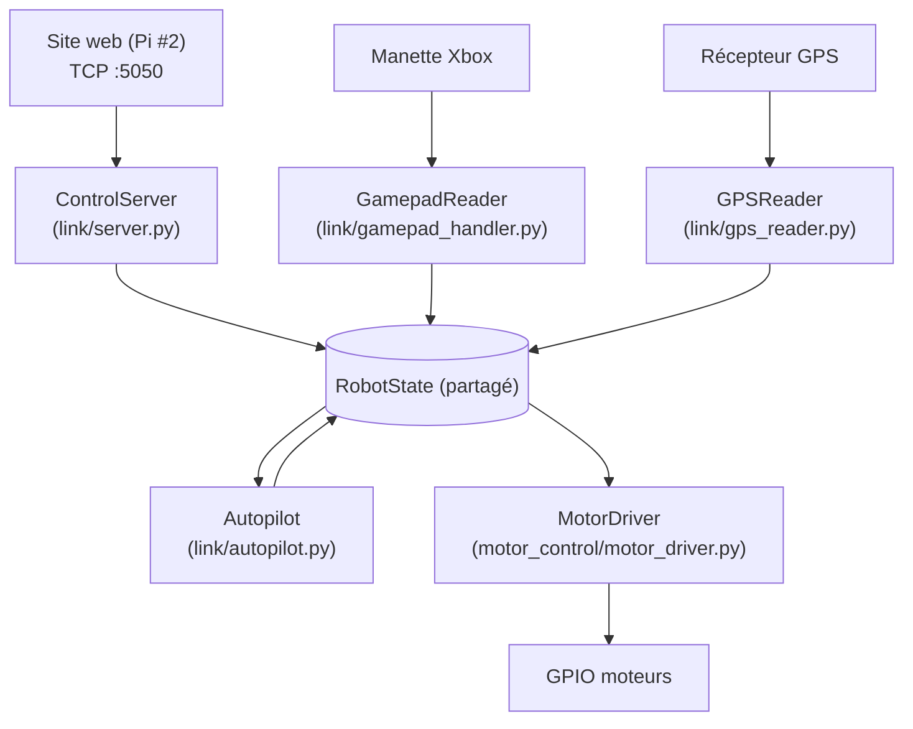

# Robot (Raspberry Pi 5)

Code embarqué sur la Raspberry Pi n°1 du projet : pilotage moteurs, télécommande,
asservissement PID et navigation GPS/DGPS pour un robot mobile d'extérieur.

Le serveur web (Flask, sur la Raspberry Pi n°2) qui envoie les ordres à ce robot
vit dans un dépôt séparé.

## Structure du projet

```
.
├── motor_control/      # Pilotage moteurs (GPIO/PWM) et entrée manette
│   ├── gpiochip.py             # Détection du gpiochip RP1 (partagée par motor_driver.py)
│   ├── motor_driver.py         # PWM logiciel + GPIO -- unique propriétaire des moteurs (voir plus bas)
│   ├── remote_control.py       # Pilotage manuel autonome (manette -> moteurs), utilisé par les 3 scripts ci-dessous
│   ├── gps_condition_logger.py       # Moteur commun aux 3 scripts ci-dessous (logique de journalisation GPS conditionnelle)
│   ├── gps_log_on_full_throttle.py   # Variante de remote_control.py : journalise le GPS en ligne droite a fond (reponse a l'echelon, translation)
│   ├── gps_log_on_full_rotation.py   # Variante de remote_control.py : journalise le GPS en rotation sur place a fond (reponse a l'echelon, rotation)
│   └── gps_log_on_full_maneuvers.py  # Variante de remote_control.py : les 2 ci-dessus a la fois, en un seul script/une seule lecture GPS
├── pid/                # Asservissement PID (distance / cap)
│   ├── pid_controller.py
│   ├── pid_plot.py               # Simulation/visualisation hors robot (ancien)
│   ├── simulate_pid.py           # Simulateur de réglage PID (1 boucle, coefficients réels)
│   └── simulate_motor_commands.py # Simulateur distance+angle -> commandes moteur PWM
├── gps/                # Lecture GPS, correction DGPS (NTRIP), calculs géo
│   ├── gps_parse.py
│   ├── gps_transfer.py
│   ├── dgps_transfer.py
│   └── gps_delta.py
├── link/               # Serveur TCP recevant les commandes du site web (voir plus bas)
│   ├── nmea.py         # Construction/analyse des trames + checksum
│   ├── robot_state.py  # Validation et état (PWM, mode, cible GPS, gains PID, appelle camera/ en HTTP pour CAM,SNAP, pilote motor_control/motor_driver.py et link/autopilot.py)
│   ├── autopilot.py    # Maths pures de navigation (distance, cap) + PID -> PWM pour le mode AUTO (voir plus bas)
│   ├── gps_reader.py   # Lecture GPS en tâche de fond (voir plus bas)
│   ├── gamepad_handler.py # Lecture manette (evdev), tâche de fond -- alimente le même RobotState que le TCP (voir plus bas)
│   └── server.py        # Serveur TCP (socketserver), démarre aussi motor_driver + gamepad_handler
├── camera/             # Flux caméra en direct + snapshots + enregistrement vidéo (voir plus bas) -- processus séparé de link/, relié par HTTP local
│   ├── stream_server.py
│   ├── snapshots.py    # Stockage des snapshots (CAM,SNAP), jamais plus de 5 fichiers
│   └── recordings.py   # Stockage des enregistrements vidéo (CAM,REC_START/REC_STOP, 2026-09-18), jamais plus de 5 fichiers
├── waypoints/          # Points GPS sauvegardés par le bouton X de la manette (link/robot_state.py's save_waypoint(), 2026-09-18) -- donnees de terrain, pas du code
├── archive/            # Anciennes versions gardées pour référence (voir plus bas), dont pwm_2026.py (ancien motor_control/pwm.py, remplacé par motor_control/motor_driver.py)
├── tests/              # Tests automatisés (pytest)
├── systemd/            # Unité systemd pour le démarrage automatique au boot (voir plus bas)
│   └── robot.service
├── run_robot.sh        # Lance link/server.py + camera/stream_server.py ensemble, arrêt propre des deux au Ctrl+C (voir plus bas)
├── start_robot.sh      # Point d'entrée au boot (2026-09-19) : active le venv puis lance run_robot.sh (voir plus bas)
├── requirements.txt
└── .env.example        # Modèle pour les identifiants NTRIP et de la caméra (voir plus bas)
```

## Installation

```bash
python3 -m venv venv
source venv/bin/activate
pip install -r requirements.txt
```

Certains modules nécessitent du matériel Raspberry Pi (`gpiod`, `evdev`) ou un
GPS branché en USB/série (`/dev/ttyACM0`) — ils ne peuvent être exécutés que sur
la Raspberry Pi n°1, pas sur un PC de développement classique.

## Configuration (identifiants NTRIP)

`gps/dgps_transfer.py` utilisait auparavant des identifiants NTRIP écrits en
dur dans le code. Ils sont maintenant lus depuis un fichier `.env` (jamais
commité, voir `.gitignore`) :

```bash
cp .env.example .env
# puis éditer .env si vous avez vos propres identifiants NTRIP
```

Sans fichier `.env`, le script retombe sur le compte public de test du réseau
Centipede (`crtk.net`), comme avant.

## Réglage des PID (hors robot)

Deux outils de simulation, sans matériel nécessaire :

```bash
# Comparer plusieurs jeux de coefficients sur une seule boucle
python3 pid/simulate_pid.py --y0 5 --setpoint 0 --kp 1 --ki 0 --kd 0,0.5,2 \
  --ylabel "Distance restante (m)"

# Voir l'effet combiné distance+angle sur les commandes moteur (left_speed/right_speed)
python3 pid/simulate_motor_commands.py --dist-kp 1 --dist-kd 0.5 --angle-kp 0.5 --angle-kd 1
```

Le second script reproduit exactement le mixage de `move_to_target()` (distance
+ angle -> `left_speed`/`right_speed`) et trace des lignes de repère à ±255
pour repérer visuellement une saturation — voir "Corrections apportées"
plus bas, deux problèmes réels ont été détectés puis corrigés grâce à cet outil.

Les coefficients par défaut dans `pid_controller.py`
(`pid_distance = PIDController(kp=1, ki=0, kd=0.5, ...)`,
`pid_angle = PIDController(kp=0.5, ki=0, kd=1, ...)`) sont ceux validés par ces
simulations (pas de dépassement ni de saturation moteur sur le modèle simulé).
Ils restent à confirmer sur le robot réel, à basse vitesse, avant un usage
complet en extérieur.

## Serveur de commandes (`link/`)

Reçoit les trames NMEA envoyées par le site web (Raspberry Pi n°2, voir
`pages/protocole_controle.html` dans le dépôt `robot-webserver` pour le
format complet des trames) et y répond par `ACK`/`ERR`/`STA`.

```bash
python3 -m link                                    # écoute sur 0.0.0.0:5050
CONTROL_HOST=0.0.0.0 CONTROL_PORT=5050 python3 -m link   # port personnalisé
```

État actuel de l'implémentation :

- `STP` (arrêt d'urgence) et `DRV` (pilotage direct) valident les entrées,
  mettent à jour un état en mémoire (`link/robot_state.py`) et pilotent
  pour de vrai les moteurs depuis le 2026-09-07, via
  `motor_control/motor_driver.py` (voir la section dédiée plus bas) —
  c'était le point explicitement laissé "à décider" dans une version
  précédente de ce README (refactoriser `pwm.py` en fonction appelable,
  ou faire cohabiter ce serveur avec l'ancien pipeline
  `dgps_transfer.py | pid_controller.py | pwm.py`) : c'est la première
  option qui a été retenue. L'ancien `motor_control/pwm.py` (script
  bloquant, GPIO ouvert dès l'import, boucle sur `stdin`) est archivé
  dans `archive/pwm_2026.py`.
- `MOD` (changement de mode -- `IDLE`/`MANUAL`/`AUTO`) a un effet réel
  immédiat sur les moteurs (voir plus bas) ; `PID` (gains `D`=distance ou
  `A`=angle) règle en direct les deux boucles PID que `link/autopilot.py`
  fait tourner pendant le pilotage `AUTO` -- utile pour ajuster les gains
  depuis la console pendant un test, sans redémarrer le serveur. `NAV`
  enregistre la cible et annule une éventuelle route `RTE` en cours (voir
  ci-dessous) — l'opérateur reprend la main.
- `RTE` (nouvelle trame, un champ `count` suivi de `count` points
  lat/lat_dir/lon/lon_dir, même format que `NAV`) enregistre une liste de
  points de passage ordonnée dans `link/robot_state.py`
  (`RobotState.route`/`route_index`) et arme le premier comme cible
  (`nav_target`). À chaque nouvelle position GPS (`update_gps_fix`), si la
  distance (haversine, `link/autopilot.py` — volontairement pas de
  réutilisation de `gps/gps_delta.py`, dont
  `distance_to_target_meter`/`angle_to_target_radius` référencent des
  variables non définies) entre la position courante et le point visé passe
  sous `ROUTE_ARRIVAL_RADIUS_M` (5 m par défaut, `float` réglable par
  variable d'environnement), la cible avance automatiquement au point
  suivant, jusqu'au dernier. `STP` et `NAV` annulent une route en cours.
  Depuis le 2026-09-07, en mode `AUTO`, le robot pilote vraiment vers
  `nav_target` à chaque fix GPS (voir la section "Pilotage moteur et
  manette" plus bas pour le détail et les limites) -- avant cette date,
  seul `nav_target`/le champ `target_*` de `STA` avançait, sans que les
  moteurs suivent. Limite : 200 points par route (`ROUTE_MAX_POINTS`).
  Voir `pages/protocole_controle.html` (dépôt `robot-webserver`) pour le
  format exact de la trame et le bouton "GPS route" de `/control` qui la
  génère depuis un fichier texte.
- `CAM,SNAP` appelle pour de vrai la route `GET /snap` de
  `camera/stream_server.py` (processus séparé, en HTTP local — voir section
  dédiée ci-dessous) et répond `ACK`/`ERR` selon que ça réussit ou non
  (caméra éteinte, pas encore de trame disponible...). `CAM,REC_START` et
  `CAM,REC_STOP` (implémentés depuis le 2026-09-18, voir la section
  "Enregistrement vidéo" plus bas — ils répondaient auparavant toujours
  `ERR CAM_NOT_IMPLEMENTED`) appellent de la même façon `GET /rec/start`/
  `GET /rec/stop` et démarrent/arrêtent un vrai enregistrement vidéo.
- `STA` (sans champ, en requête) répond avec l'état courant : position
  *courante* (`lat`/`lat_dir`/`lon`/`lon_dir`), `cap` et `speed` sont lus
  pour de vrai depuis un récepteur GPS série par `link/gps_reader.py` (voir
  section dédiée ci-dessous) — `0.0` tant qu'aucun récepteur n'est branché
  ou qu'aucune trame valide n'a été reçue. Position *cible*
  (`target_lat`/`target_lat_dir`/`target_lon`/`target_lon_dir`, dernière
  trame `NAV` reçue), `left_pwm`/`right_pwm` et `mode` sont réels dès
  aujourd'hui. `batterie` reste à 0 (aucun capteur de batterie dans le
  projet). Depuis le 2026-09-19, un champ `dgps` a été ajouté en fin de
  trame (extension, les champs existants ne bougent pas) : `"DGPS"` dès
  qu'une trame GGA a rapporté un fix corrigé en différentiel
  (`link/gps_reader.py`, `DGPS_QUALITY`), `"GPS"` dès qu'une trame GGA a
  rapporté un fix non corrigé, `"UNKNOWN"` tant qu'aucune trame GGA avec
  indicateur de qualité n'a encore été reçue (pas de récepteur branché,
  uniquement des trames RMC jusqu'ici, ou pas encore de fix) — voir
  `RobotState.is_dgps`. Tout ça alimente le bandeau de statut et l'onglet
  "TCP" de `/control` sur le site web.
- `WPT` et `GRT` (2026-09-19, nouvelles trames en requête, sans champ) :
  ajoutées pour la carte GPS de `/control` sur le site web (voir le dépôt
  `robot-webserver`). `WPT` répond avec tous les points sauvegardés par le
  bouton `X` de la manette (`RobotState.list_waypoints()`, relit
  `waypoints/waypoints.txt`) — mêmes champs qu'`RTE` (`count` puis
  `count` × `lat,lat_dir,lon,lon_dir`), converti au format ddmm.mmmm au
  passage puisque le fichier stocke des degrés décimaux bruts. `GRT`
  répond avec la route actuellement active (`RobotState.get_route()`,
  donc vide tant qu'aucun `RTE` n'a été envoyé, ou après un `STP`/`NAV`
  qui l'a annulée) — déjà au format ddmm.mmmm, donc renvoyée telle quelle.
  Ni l'une ni l'autre ne modifie l'état du robot : ce sont de pures
  lectures, comme `STA`.

## Pilotage moteur et manette (`motor_control/motor_driver.py`, `link/gamepad_handler.py`)

Depuis le 2026-09-07, `link/server.py` démarre trois tâches de fond en plus
du serveur TCP lui-même, toutes alimentant/lisant le même `RobotState` (voir
schéma ci-dessous) :

- `motor_control/motor_driver.py` (`MotorDriver`) : unique propriétaire de
  la puce GPIO et du PWM logiciel des deux moteurs. Refactor de l'ancien
  `motor_control/pwm.py` (archivé, voir `archive/pwm_2026.py`) en classe
  réellement importable/réutilisable — c'était le point que ce README
  laissait explicitement "à décider" avant le 2026-09-07. `drive(left,
  right)` est un simple setter protégé par verrou (sûr à appeler depuis
  n'importe quel thread), la boucle PWM elle-même tourne dans un thread
  dédié.
- `link/gamepad_handler.py` (`GamepadReader`) : lit une manette Xbox via
  `evdev` (remplace `pygame`, plus fiable en headless -- voir le
  docstring du module) et appelle directement `RobotState.drive()` (stick
  gauche/droit) et `RobotState.set_mode()` (boutons) -- la manette et les
  trames TCP du site web sont deux entrées symétriques du même état, ni
  l'une ni l'autre ne touche au GPIO directement.
- Boutons de la manette (voir `robot_state_button_handler()`) -- la
  manette est écoutée en permanence et le mode `MANUAL` reprend toujours
  la main dès qu'un stick est réellement bougé, même en pleine conduite
  `AUTO` (voir `robot_state_drive_handler()`) -- il n'y a donc pas de
  bouton `MOD` sur le site, un opérateur physique n'en a jamais besoin
  pour reprendre le contrôle.

  **Remap du 2026-09-18 (cluster droit `A`/`B`/`X`/`Y`)** -- remplace
  totalement le mapping du 2026-09-12 :
  - **`A`** (déplacé depuis `Y`) : réarme le mode `AUTO`, mais seulement
    s'il y a déjà une cible (`NAV` envoyé depuis le site, ou une route GPS
    importée) -- appuyer dessus sans cible ne fait rien
    (`RobotState.has_nav_target()`), plutôt que d'armer un mode qui ne
    calculerait rien à chaque trame GPS.
  - **`B`** (nouveau -- remplace l'ancien arrêt complet) : démarre/arrête
    l'enregistrement vidéo (`CAM,REC_START`/`CAM,REC_STOP`, voir la
    section "Flux caméra en direct" plus bas) -- une pression bascule
    entre les deux selon `RobotState.is_recording`. Ne fait rien de
    dangereux si la caméra n'est pas branchée/pas prête : l'appel échoue
    proprement (voir la caméra ci-dessous), c'est juste enregistré dans
    les logs, pas propagé plus loin.
  - **`X`** (nouveau) : enregistre le point GPS courant (`RobotState.
    save_waypoint()`) dans un fichier `waypoints/waypoints.txt` à la
    racine du dépôt (personnalisable via `WAYPOINTS_FILE`, voir
    `.env.example`) -- une ligne `lat,lon,timestamp` en degrés décimaux
    par point, volontairement le même format `lat,lon` (colonnes en plus
    ignorées) que l'upload "GPS Driving" du site web (`robot-webserver`),
    pour pouvoir réutiliser un point sauvegardé ici comme route sans
    aucune conversion. Ne fait rien s'il n'y a pas encore de fix GPS.
  - **`Y`** (déplacé depuis l'ancien `X`, N/A avant cette date) : prend un
    instantané de la caméra (`CAM,SNAP`) -- commande déjà existante côté
    site web, juste rendue accessible depuis la manette aussi.
  - **`START`** (inchangé) : arrête le robot puis éteint la Raspberry Pi
    -- voir la note sudo ci-dessous et surtout la section "`START`
    n'éteint pas la Pi" un peu plus bas, qui couvre TOUTES les causes
    connues, pas seulement la config sudo.
  - **Plus de bouton d'arrêt complet dédié sur la manette** : `B`
    enregistrait vidéo maintenant à la place de l'ancien arrêt complet --
    **choix délibéré, pas un oubli** (voir le docstring de
    `robot_state_button_handler()`), documenté ici parce qu'il retire un
    bouton d'arrêt d'urgence physique de la manette. Deux filets de
    sécurité restent : n'importe quel mouvement de stick reprend
    immédiatement la main en `MANUAL`, même en pleine conduite `AUTO`, et
    le site web garde son propre bouton "STOP" (envoie `STP`
    instantanément, sans étape console). Pour remettre un bouton d'arrêt
    dédié sur la manette, régler `GAMEPAD_STOP_BTN` (voir `.env.example`)
    sur un bouton libre, par exemple une gâchette/butée d'épaule
    (`BTN_TL`/`BTN_TR`, non utilisées par ce mapping).

  Tous ces boutons se règlent sans toucher au code via
  `GAMEPAD_ARM_AUTO_BTN`/`GAMEPAD_RECORD_BTN`/`GAMEPAD_SAVE_WAYPOINT_BTN`/
  `GAMEPAD_SNAPSHOT_BTN`/`GAMEPAD_SHUTDOWN_BTN`/`GAMEPAD_STOP_BTN` (voir
  `.env.example`), pour la même raison que d'habitude dans ce projet : la
  manette/récepteur réellement utilisés ici peuvent reporter un bouton
  sous un code évdev différent de celui que son étiquette suggère --
  section "`Y` se comporte comme `A`" plus bas.

  **Configuration requise pour `START` (`sudo poweroff` sans mot de
  passe)** : l'utilisateur qui lance `run_robot.sh` doit pouvoir exécuter
  la commande de `SHUTDOWN_CMD` (par défaut `sudo poweroff`) sans qu'un
  mot de passe soit demandé, sinon `_shutdown_pi()` échoue silencieusement
  côté extinction (elle logue une erreur, et arrête quand même les
  scripts Python de ce robot). Sur Raspberry Pi OS, ça se configure avec
  `sudo visudo -f /etc/sudoers.d/robot-shutdown` et une ligne comme :
  ```
  robot ALL=(ALL) NOPASSWD: /usr/sbin/poweroff
  ```
  (remplacer `robot` par le nom d'utilisateur réel, et adapter le chemin
  si `SHUTDOWN_CMD` est personnalisé -- `which poweroff` pour le vérifier).



**IMPORTANT — ce qui est réel et ce qui ne l'est pas encore** : `DRV`
manuel (TCP ou joysticks de la manette) pilote vraiment les moteurs, et
depuis le 2026-09-07 le mode `AUTO` aussi : `link/autopilot.py` calcule,
à chaque nouvelle position GPS, la distance et l'écart de cap vers
`nav_target` (posé par `NAV` ou `RTE`), les passe dans deux
`PIDController` (distance, cap) et envoie le résultat aux moteurs --
exactement ce que faisait un `DRV` manuel, mais calculé automatiquement.
`RTE` avance donc vraiment de point en point tout seul une fois `Y`
appuyé (`A` avant le 2026-09-12, voir la section "Pilotage moteur et
manette" plus haut). **Limite réelle, pas cachée** : il n'y a pas de boussole/IMU sur
ce robot -- le seul cap disponible est le cap sur le fond (`cap`, trame
GPRMC du GPS), qui n'a de sens que si le robot est déjà en mouvement ;
à l'arrêt ou juste après un départ, il peut être bruité/périmé et faire
temporairement corriger le PID dans le mauvais sens. Et les gains PID
(`kp=1/ki=0/kd=0.5` distance, `kp=0.5/ki=0/kd=1` cap) ne sont validés
qu'en simulation hors-ligne (voir "Réglage des PID hors robot" plus bas)
-- à retester en vrai, à faible vitesse, sous surveillance, avant de
laisser le robot livré à lui-même.

**Note matérielle, confirmée le 2026-09-07** : les deux moteurs sont
montés en miroir (un de chaque côté du châssis) et câblés en polarité
inversée l'un par rapport à l'autre, exprès, pour pouvoir utiliser le
même modèle de moteur des deux côtés. Cette compensation est entièrement
gérée par le câblage physique (quel fil moteur va sur quelle borne du
pont en H) -- confirmé par le test de terrain "full throttle"
(2026-09-05/06, les deux moteurs à +255/+255) : le robot avançait déjà
tout droit, pas en cercle. `motor_control/motor_driver.py` n'applique
donc volontairement **aucune** inversion logicielle supplémentaire entre
`left_pwm`/`right_pwm` -- en ajouter une annulerait cette compensation
déjà correcte et ferait tourner le robot sur lui-même au lieu d'avancer
droit. Les numéros de broches `MOTOR1_SENS1`/`MOTOR1_SENS2` (14/15,
valeurs de `remote_control.py`, déjà validées sur le robot réel) restent
donc tels quels ; l'ancien `pwm.py` (archivé, jamais câblé à rien de réel)
avait ces deux broches inversées (15/14), mais c'était un résidu d'un
fichier jamais testé, pas un indice d'inversion à reproduire.

**Honnêteté** : `evdev` et `gpiod` n'ont pas pu être installés dans le bac
à sable où ce refactor a été écrit (pas d'accès PyPI). La logique pure
(calcul PWM, normalisation d'axes, détection d'appui bouton) est testée
pour de vrai (`tests/test_motor_driver.py`, `tests/test_gamepad_handler.py`).
Le reste (ouverture réelle de la puce GPIO, lecture réelle d'une manette)
est écrit contre l'API documentée de ces bibliothèques mais n'a pas tourné
sur la Pi -- à vérifier avant de s'y fier plus loin que "la dégradation
propre en cas d'absence de matériel fonctionne" (elle, testée pour de
vrai).

**Correction confirmée sur le terrain (2026-09-11)** : le stick droit ne
répondait pas du tout via `GamepadReader`, alors que le stick gauche
fonctionnait -- diagnostiqué avec `motor_control/dump_gamepad_axes.py`
(voir section suivante) : sur la manette/récepteur réellement utilisés
ici, le stick droit remonte sous le code évdev `ABS_RZ`, pas `ABS_RY` (le
mapping "standard" du pilote xpad, utilisé par défaut jusque-là).
`link/gamepad_handler.py`'s `DEFAULT_RIGHT_Y_CODE` est maintenant réglé
sur `"ABS_RZ"` en conséquence (une première lecture avait donné `ABS_Z`
-- le code de la gâchette gauche dans le mapping standard -- corrigé en
`ABS_RZ` une fois l'erreur de lecture repérée). Si une autre manette/un
autre récepteur est utilisé un jour et suit le mapping standard après
tout, ne pas revenir en arrière à l'aveugle -- relancer
`dump_gamepad_axes.py` sur ce matériel précis d'abord.

**Deux bugs corrigés suite à un retour terrain (2026-09-12) : "`Y` et
`START` ne fonctionnent pas comme prévu" et "le mode `AUTO` ne s'enclenche
jamais".**

1. **`AUTO` s'armait (le mode passait bien à `AUTO`) mais le robot ne
   bougeait jamais.** Cause réelle : `robot_state_drive_handler()`
   (appelée à *chaque* évènement d'axe, y compris le bruit analogique
   d'un stick immobile/centré -- `_pwm_from_axis` ramène ça à `(0, 0)`)
   appelait `state.drive(0, 0)` sans condition, quel que soit le mode
   actif. Or `RobotState.drive()` remet toujours `left_pwm`/`right_pwm`
   à zéro et coupe les moteurs, sans regarder le mode -- en `AUTO`, ce
   `(0, 0)` du stick immobile (qui arrive plusieurs fois par seconde)
   écrasait donc systématiquement le PWM que l'autopilote venait de
   calculer à la dernière trame GPS, juste après. Corrigé en ajoutant
   `RobotState.is_manual()` : un stick centré ne touche plus du tout aux
   moteurs tant que le mode n'est pas déjà `MANUAL` (relâcher le stick
   pendant une conduite manuelle continue de couper les moteurs
   normalement, c'est uniquement l'idle en `AUTO`/`IDLE` qui est
   maintenant ignoré).
2. **`Y` et `START` "ne répondent pas comme prévu"** : même famille de bug
   que le stick droit ci-dessus (une manette/un récepteur qui ne suit pas
   le mapping "standard" xpad), mais côté boutons cette fois --
   `robot_state_button_handler()` comparait les codes évdev reçus à des
   constantes figées (`ecodes.BTN_Y`/`ecodes.BTN_START`) sans aucun moyen
   de les corriger sans modifier le code. Elle accepte maintenant les
   noms des boutons en paramètres (`arm_auto_btn`/`stop_btn`/
   `shutdown_btn`, résolus dynamiquement sur `evdev.ecodes`), et
   `link/server.py` les lit depuis `GAMEPAD_ARM_AUTO_BTN`/
   `GAMEPAD_STOP_BTN`/`GAMEPAD_SHUTDOWN_BTN` (voir `.env.example`) --
   valeurs par défaut inchangées (`BTN_Y`/`BTN_B`/`BTN_START`). Reste à
   confirmer sur le vrai matériel : lancer
   `python3 -m motor_control.dump_gamepad_buttons` (voir section
   suivante), appuyer sur `Y` et `Start`, et si le code affiché n'est pas
   `BTN_Y`/`BTN_START`, régler la variable d'environnement correspondante
   sur le nom réel (sans toucher au code, même principe que
   `DEFAULT_RIGHT_Y_CODE` pour l'axe droit).

### Retour terrain (2026-09-18) : "`Y` se comporte comme `A`", et pourquoi `START` n'éteint pas la Pi

**"`Y` se comporte comme `A`"** : relu la documentation `evdev` et le code
de `link/gamepad_handler.py`/`robot_state_button_handler()` en détail --
deux explications réelles et plausibles, documentées directement dans le
commentaire "BUTTON MAPPING" en haut de `link/gamepad_handler.py`, et il
n'est pas possible de trancher entre les deux sans lancer le diagnostic
sur le matériel réel :

1. `evdev.ecodes.BTN_A`/`BTN_B`/`BTN_X`/`BTN_Y` ne sont **pas** des codes
   indépendants : ce sont des alias que le noyau Linux définit sur un jeu
   de codes positionnels -- `BTN_A == BTN_SOUTH`, `BTN_B == BTN_EAST`,
   `BTN_X == BTN_NORTH`, `BTN_Y == BTN_WEST` (voir
   `linux/input-event-codes.h`). Sur une vraie manette Xbox, `Y` est en
   position NORD et `X` en position OUEST -- soit l'inverse de ce que le
   nommage du noyau laisserait penser par rapport à la disposition
   physique de Microsoft. La plupart des pilotes/récepteurs compensent
   pour que `BTN_X`/`BTN_Y` correspondent bien aux étiquettes imprimées,
   mais pas tous les récepteurs tiers/pilotes HID génériques ne le font.
2. Un récepteur qui expose cette manette sous l'**ancien** jeu d'évènements
   joystick (pré-"gamepad") -- `BTN_TRIGGER`, `BTN_THUMB`, `BTN_TOP`,
   `BTN_BASE`, ... -- est également courant sur du matériel tiers bon
   marché (voir `motor_control/dump_gamepad_buttons.py`'s
   `KNOWN_BUTTON_NAMES` pour la liste complète).

Dans les deux cas, la correction ne demande **pas** de modifier le code :
lancer `python3 -m motor_control.dump_gamepad_buttons` sur la Pi, appuyer
sur chaque bouton physique un par un, noter le nom/code réel affiché pour
chacun, puis régler les variables d'environnement `GAMEPAD_*_BTN`
correspondantes (voir `.env.example` et le remap ci-dessus) sur les noms
réels plutôt que deviner.

**Pourquoi `START` n'éteint pas la Pi** : deux causes possibles, à
vérifier dans cet ordre --

1. **La manette n'est pas détectée du tout.** Bug réel corrigé le
   2026-09-18 : `GamepadReader._find_device()` (et la copie de ce même
   prédicat dans `dump_gamepad_buttons.py`) exigeait jusqu'ici la
   présence du code évdev `BTN_A` spécifiquement pour reconnaître un
   périphérique comme une manette. Si ce récepteur reporte tous ses
   boutons sous l'ancien jeu joystick (hypothèse 2 ci-dessus, où `BTN_A`
   n'existe tout simplement pas), la manette entière n'était alors
   **jamais trouvée** -- pas seulement un bouton mal étiqueté : `START`
   (et absolument tous les autres boutons/joysticks) restait alors
   silencieusement inerte, le log répétant juste "no gamepad found"
   toutes les `RETRY_INTERVAL_S` secondes. `_find_device()` (et son
   équivalent dans `dump_gamepad_buttons.py`) reconnaît maintenant un
   périphérique dès qu'il expose soit `BTN_A` (jeu moderne), soit
   `BTN_TRIGGER` (ancien jeu joystick) -- voir
   `GAMEPAD_IDENTIFYING_BUTTONS` dans `link/gamepad_handler.py`. Si
   `python3 -m motor_control.dump_gamepad_buttons` n'affiche **rien du
   tout**, même en appuyant sur tous les boutons, c'est le signe que la
   manette n'est pas détectée -- vérifier avec `python3 -c "from evdev
   import list_devices, InputDevice; [print(InputDevice(p).name, p) for p
   in list_devices()]"` qu'elle apparaît bien dans la liste des
   périphériques `evdev` du tout.
2. **La config sudo n'est pas faite.** Si la manette répond bien (les
   autres boutons fonctionnent, `dump_gamepad_buttons.py` affiche bien
   `BTN_START` en appuyant sur `Start`) mais que la Pi ne s'éteint
   toujours pas, voir la configuration `sudo poweroff` sans mot de passe
   plus haut dans cette même section -- `_shutdown_pi()` logue une erreur
   claire dans ce cas (`could not power off the Raspberry Pi`), donc
   regarder les logs de `python3 -m link` est le premier réflexe pour
   distinguer ces deux causes.

### Retour terrain (2026-09-19) : le bouton `A` (armer AUTO) ne semble rien faire

Diagnostic différent du "`Y` se comporte comme `A`" ci-dessus : ici `A` est
bien le bon bouton (le bon code évdev arrive bien jusqu'à
`robot_state_button_handler()`), mais le mode `AUTO` semble retomber tout
seul immédiatement, comme si l'appui n'avait servi à rien.

**Cause réelle, une fois `GamepadReader._read_events()` et
`robot_state_drive_handler()` relus ensemble** : `_read_events()` appelle
`on_drive()` sur **chaque** évènement `EV_ABS`, y compris le bruit
analogique qu'un stick centré et non touché continue de produire tout
seul (ce n'est pas réservé à une vraie poussée). Or
`robot_state_drive_handler()`'s `_on_drive()` traite **toute** PWM non
nulle comme "une vraie poussée du joystick" et repasse immédiatement en
`MANUAL` (`state.set_mode("MANUAL")`) avant même de regarder quoi que ce
soit d'autre -- c'est la convention "le manuel reprend toujours la main"
documentée plus haut. Avec l'ancienne zone morte (`AXIS_DEADZONE = 0.08`,
soit environ ±20 unités PWM brutes sur 255), le bruit au repos de cette
manette précise (mesuré jusqu'à environ ±30 unités) dépassait ce seuil --
donc quasiment chaque évènement de bruit repassait en `MANUAL` juste après
que `A` ait appelé `state.set_mode("AUTO")`, en quelques millisecondes
(les évènements `EV_ABS` arrivent en continu, plusieurs fois par seconde
même stick lâché). Rien à voir avec le bouton lui-même : indiscernable en
pratique de "appuyer sur `A` ne fait rien".

**Correction appliquée** : `AXIS_DEADZONE` (dans `link/gamepad_handler.py`)
est passé de `0.08` (~20/255) à `30/255` (~0.1176), pour couvrir
explicitement le niveau de bruit rapporté sur cette manette. Concrètement,
`_pwm_from_axis()` renvoie maintenant `0` pour ce bruit-là, qui n'atteint
donc plus jamais `on_drive()` comme "une vraie poussée" -- `AUTO` reste
armé tant qu'un vrai mouvement de stick (ou un autre changement de mode)
ne le change pas. Deux tests couvrent cette régression dans
`tests/test_gamepad_handler.py` :
`test_pwm_from_axis_deadzone_covers_documented_joystick_noise` (la zone
morte seule) et
`test_read_events_and_drive_handler_together_survive_the_documented_joystick_noise`
(le chemin complet `_read_events()` → `robot_state_drive_handler()`, avec
une valeur brute d'axe calculée pour retomber exactement dans la bande de
bruit documentée).

Si une manette encore plus bruyante que ±30 est rencontrée sur le terrain,
relancer `motor_control/dump_gamepad_axes.py` dessus pour mesurer le bruit
réel plutôt que d'augmenter `AXIS_DEADZONE` au hasard -- une zone morte
trop large finirait par ignorer aussi de vrais petits mouvements de stick.

### Vibrations de la manette (2026-09-18)

Toute vibration liée aux scripts de terrain `motor_control/
gps_log_on_full_*.py` a été retirée (ils ne touchent plus du tout le
moteur de vibration de la manette) -- ces scripts ne servent qu'à
enregistrer des logs GPS pendant une manœuvre spécifique, la vibration
continue qui accompagnait ça n'a plus de raison d'être avec la nouvelle
fonctionnalité ci-dessous, qui couvre un usage réel du robot plutôt qu'un
test de terrain ponctuel. Les crochets `on_transition`/`on_gps_quality`
restent disponibles, inutilisés, dans `motor_control/
gps_condition_logger.py` si une future fonctionnalité en a besoin.

À la place, `link/server.py` fait vibrer la manette une seule fois,
brièvement (`GamepadReader.pulse()`, 2026-09-18), exactement au moment où
la qualité du fix GPS **change réellement** en conduite réelle (voir
`link/gps_reader.py`'s `GPSReader.on_gps_quality`, déclenché uniquement
sur un vrai changement, jamais à chaque trame GGA) :
- vibration **forte** de `DGPS_PULSE_DURATION_S` (0.5s par défaut) quand
  le fix devient corrigé DGPS ;
- vibration **faible** de la même durée quand il perd ce niveau de
  précision.

`start_rumble()`/`stop_rumble()`/`set_intensity()` (vibration continue)
restent disponibles sur `GamepadReader` pour un futur besoin, mais plus
aucun appelant de ce dépôt ne les utilise directement aujourd'hui --
`pulse()` est ce qu'un évènement ponctuel comme celui-ci doit utiliser à
la place.

### Vérifier rapidement une manette (`motor_control/check_gamepad.py`)

Petit script de diagnostic autonome (pas de moteurs, pas de GPS) pour
tester une manette avant de partir sur le terrain -- utile pour confirmer
qu'un stick répond bien avant de compter dessus pendant un essai réel :

```bash
python3 -m motor_control.check_gamepad
```

Bouge le stick **droit** à fond dans chaque direction puis relâche-le ;
le script affiche chaque changement de valeur en direct et, à l'arrêt
(Ctrl+C), un verdict en clair (fonctionnel / mort / semble sous-débattre).
Réutilise `link.gamepad_handler.GamepadReader` tel quel (même détection/
reconnexion que partout ailleurs dans ce projet) -- même honnêteté que le
reste : la logique du verdict est testée (`tests/test_check_gamepad.py`),
la lecture réelle d'une manette ne l'est pas dans ce bac à sable.

Si ce script indique qu'un stick ne répond pas du tout (comme ça a été le
cas pour le stick droit, voir plus haut), l'étape suivante est
`motor_control/dump_gamepad_axes.py` : il affiche le code évdev brut de
**chaque** axe bougé, sans aucun filtrage par `GamepadReader` -- utile
pour découvrir empiriquement sous quel nom un stick remonte réellement
au lieu de deviner :

```bash
python3 -m motor_control.dump_gamepad_axes
```

De la même façon, si `Y` ou `START` ne déclenchent pas le comportement
attendu (voir le point 2 juste au-dessus), `motor_control/
dump_gamepad_buttons.py` affiche le code évdev brut de **chaque** bouton
appuyé/relâché, sans le filtrage de `robot_state_button_handler()` :

```bash
python3 -m motor_control.dump_gamepad_buttons
```

Appuyer sur `A`, `B`, `X`, `Y` et `Start` un par un (voir le remap du
2026-09-18 plus haut pour ce que chacun fait désormais) ; si un nom
affiché ne correspond pas à ce qui est attendu (`BTN_A`/`BTN_B`/`BTN_X`/
`BTN_Y`/`BTN_START`), régler la variable `GAMEPAD_*_BTN` correspondante
(voir `.env.example`) sur le nom réel plutôt que de deviner. Si
**aucun** bouton n'affiche quoi que ce soit, voir "Pourquoi `START`
n'éteint pas la Pi" ci-dessus, point 1 : la manette n'est peut-être pas
détectée du tout.

## Lecture GPS (`link/gps_reader.py`)

Tourne automatiquement en arrière-plan dans `link/server.py` (désactivable
avec `GPS_ENABLED=false`) : lit un récepteur GPS série (même matériel que
`gps/gps_transfer.py`/`gps/gps_parse.py` — trames `GPRMC`/`GGA` via
`pynmea2`) et met à jour la position courante, le cap et la vitesse
utilisés par `STA`. Se dégrade proprement si aucun récepteur n'est
branché (ou si `pynmea2`/`pyserial` ne sont pas installés) : un
avertissement dans les logs, et le serveur de contrôle continue de
fonctionner normalement avec la position courante à `0.0`.

```bash
python3 -m link                          # GPS sur /dev/ttyACM0 @ 57600 bauds par défaut
GPS_DEVICE=/dev/ttyACM1 python3 -m link  # port série personnalisé
GPS_ENABLED=false python3 -m link        # désactive la lecture GPS (utile si gps_transfer.py
                                          # ou gps_parse.py utilise déjà le port série --
                                          # un seul processus peut l'ouvrir à la fois)
```

**Non testé sur un vrai récepteur** : `pynmea2` et `pyserial` (déjà dans
`requirements.txt`) n'ont pas pu être installés dans l'environnement où
ce module a été écrit (pas d'accès PyPI, même limitation que pour
`pytest`). Le calcul de conversion de coordonnées (`link/nmea.py`,
`decimal_to_nmea`/`nmea_to_decimal`) est testé pour de vrai ; le parsing
`GPRMC`/`GGA` (`tests/test_gps_reader.py`) est écrit contre l'API
documentée de `pynmea2` mais n'a jamais tourné pour de vrai — lancer
`pytest tests/test_gps_reader.py` sur la Pi avant de lui faire confiance.
La dégradation propre (récepteur absent, bibliothèques absentes) a en
revanche été vérifiée pour de vrai : le serveur démarre et répond
normalement dans les deux cas.

## Journalisation GPS pour courbes de réponse à l'échelon (`motor_control/gps_log_on_full_*.py`)

Trois variantes de `motor_control/remote_control.py` (même manette, mêmes
moteurs -- interface publique de `Remote` inchangée depuis le refactor du
2026-09-07, voir la section "Pilotage moteur et manette" ci-dessus),
pensées pour définir les courbes de réponse à l'échelon du robot — une en
translation, une en rotation, une
troisième qui fait les deux à la fois — sans avoir à trier tout le reste
du trajet dans les données GPS. Chacune s'appuie sur
`motor_control/gps_condition_logger.py` (moteur commun aux trois), qui
lit en continu le GPS série (même matériel/port que `gps/gps_parse.py`
et `link/gps_reader.py`) et n'écrit dans un fichier de log que lorsque
les deux moteurs remplissent une condition précise :

- **`gps_log_on_full_throttle.py`** — ligne droite à fond :
  `dutyCycleLeft` ET `dutyCycleRight` == 255 (même sens, pleine
  puissance) → `motor_control/full_throttle_gps.log`, marqueurs
  `FULL_THROTTLE_START`/`FULL_THROTTLE_END`. Utile pour la vitesse de
  pointe et la dérive en ligne droite.
- **`gps_log_on_full_rotation.py`** — rotation sur place à fond :
  `dutyCycleLeft`/`dutyCycleRight` == +255/-255 ou -255/+255 (sens
  opposés, pleine puissance) → `motor_control/full_rotation_gps.log`,
  marqueurs `FULL_ROTATION_START`/`FULL_ROTATION_END`. Ici c'est le
  **cap** GPS qui est le signal intéressant, pas la position — le robot
  pivote quasiment sur place, sa position GPS ne bouge quasiment pas.
- **`gps_log_on_full_maneuvers.py`** — les deux conditions ci-dessus
  surveillées **en même temps**, dans un seul script : plus besoin de
  savoir à l'avance quelle manœuvre tu vas faire, chaque fichier de log
  se remplit tout seul dès que sa condition se produit. Techniquement,
  ce script ouvre le port série GPS **une seule fois** et teste les deux
  conditions sur chaque trame reçue (via
  `gps_condition_logger.MultiConditionGPSLogger`) — c'est important : le
  port série ne supporte pas d'être lu par deux processus en même temps
  (les trames se répartiraient au hasard entre les deux lecteurs), donc
  ne lance jamais ce script en même temps que les deux précédents, ni les
  deux précédents ensemble.

```bash
python3 -m motor_control.gps_log_on_full_throttle    # translation seule
python3 -m motor_control.gps_log_on_full_rotation    # rotation seule
python3 -m motor_control.gps_log_on_full_maneuvers   # les deux a la fois (1 seul a la fois !)
```

Dans tous les cas, les trames NMEA brutes sont horodatées et chaque
fichier de log (déjà ignoré par git, comme tout `*.log`) reste vide (ou
ne contient que des marqueurs) tant que sa condition exacte n'a jamais
été atteinte pendant la session — ce n'est pas un bug.

**Non testé sur le robot réel** : comme pour `link/gps_reader.py`,
`pyserial`, `evdev`, `pygame`, `gpiod` et `pynmea2` n'ont pas pu être
installés dans l'environnement où ces scripts ont été écrits (pas d'accès
PyPI). Seules les parties pures et sans matériel sont réellement testées :
`is_full_throttle()`/`is_full_rotation()`
(`tests/test_gps_log_on_full_throttle.py`,
`tests/test_gps_log_on_full_rotation.py`), la logique de répartition
d'une trame entre plusieurs conditions
(`MultiConditionGPSLogger._writes_for_line()`, dans
`tests/test_gps_condition_logger.py`), et la lecture de la qualité GGA
(`_gga_quality()`/`is_dgps_quality()`, dans `tests/test_gga_quality.py`,
sauté automatiquement si `pynmea2` n'est pas installé) ; le reste
(lecture série, intégration avec `Remote`) est écrit contre les API
documentées mais n'a jamais tourné pour de vrai — à vérifier sur la Pi,
manette et récepteur GPS branchés, avant de leur faire confiance.

### Retour vibrant sur la manette pendant l'enregistrement (retiré le 2026-09-18)

**Ce comportement a été retiré.** Jusqu'au 2026-09-18, pendant qu'une des
conditions ci-dessus était active (donc pendant que des données étaient
réellement écrites dans un `.log`), la manette Xbox vibrait en continu —
forte tant que la trame `GGA` la plus récente indiquait un point DGPS
(`gps_qual == 2`), faible sinon — confirmation physique, sans avoir à
regarder un écran en conduisant, que l'enregistrement était en cours et
avec quelle qualité de fix. Les trois scripts de terrain ci-dessus ne
câblent plus rien sur la manette : ils se contentent d'écrire leurs
fichiers de log, silencieusement côté vibration.

À la place, `link/server.py` fait vibrer la manette pour un usage réel du
robot plutôt que pour un test de terrain ponctuel : un bref pulse (fort en
gagnant le DGPS, faible en le perdant) dès que le fix GPS **réellement
utilisé pour piloter le robot** change de qualité, voir la section
"Vibrations de la manette (2026-09-18)" plus haut. Les callbacks
`on_transition`/`on_gps_quality` de `gps_condition_logger.py` existent
toujours (inchangés, juste plus appelés par personne dans ce dépôt) si un
futur script de terrain veut les réutiliser.

**Point d'attention terrain (toujours valable pour `check_rumble.py`
ci-dessous et pour la nouvelle fonctionnalité DGPS)** : le support du
force-feedback sur manette
Xbox sous Linux (pilote `xpad`) est fiable en filaire (USB), mais peut
être capricieux en Bluetooth selon la version du noyau/pilote. Si la
manette ne vibre pas du tout, tester d'abord en filaire avant de
suspecter un bug côté code.

**Correction (2026-09-11) — "les vibrations ne fonctionnent pas"** :
avant cette date, `_rumble_loop()` avalait silencieusement toute erreur
(`except OSError` nu, sans log) et ne vérifiait jamais si la manette
annonçait réellement le support `FF_RUMBLE` avant d'essayer d'uploader un
effet — une manette/connexion qui ne le supporte pas du tout (cas
plausible en Bluetooth, voir ci-dessus) produisait donc un silence total
et permanent, indiscernable d'un "rien à signaler". Deux changements :

1. `_rumble_loop()` vérifie maintenant explicitement le support
   `FF_RUMBLE` de la manette connectée (`_supports_ff_rumble()`) et log
   un avertissement clair (une seule fois par connexion) si ce n'est pas
   le cas, au lieu de retenter un upload voué à l'échec en boucle. Les
   vraies erreurs `OSError` (manette débranchée en cours de pulse, etc.)
   sont également maintenant journalisées, avec une limite d'une par
   `RUMBLE_ERROR_LOG_INTERVAL_S` (5s) pour ne pas noyer les logs.
2. Nouveau script `motor_control/check_rumble.py` : isole complètement la
   question "la vibration fonctionne-t-elle sur cette manette ?" de tout
   le reste (pas de GPS, pas de conditions à déclencher) — il annonce si
   `FF_RUMBLE` est supporté et, si oui, fait vibrer réellement la manette
   2s fort puis 2s faible pour vérifier à la main que les deux intensités
   se sentent bien.

```bash
python3 -m motor_control.check_rumble
```

Si ce script annonce "NOT supported", le problème est matériel/pilote
(essayer la manette en filaire) et non un bug du code ; s'il annonce
"supported" mais que rien ne se sent, c'est là qu'il faut creuser côté
code (ou côté moteur de vibration de la manette elle-même).

## Flux caméra en direct (`camera/`)

Diffuse l'image d'une webcam USB branchée sur cette Pi en MJPEG sur HTTP
(`multipart/x-mixed-replace`), un format que tout navigateur affiche
nativement dans une simple balise `` — pas de plugin, pas de
WebRTC. Le site web (Raspberry Pi n°2) ne charge jamais ce flux
directement : il le relaie depuis sa propre route `/media/camera` (voir le
README de `robot-webserver`), pour qu'il reste derrière le login du site
plutôt que d'être exposé directement sur le réseau local. Sur la page
`/control`, ce flux en direct prend automatiquement la place de la
playlist vidéo dès qu'il est disponible, et on retombe sur la playlist
s'il devient injoignable.

```bash
python3 -m camera                    # écoute sur 0.0.0.0:8000
CAMERA_DEVICE=/dev/video2 CAMERA_PORT=8000 python3 -m camera
```

Variables d'environnement disponibles (toutes optionnelles) :
`CAMERA_DEVICE` (index ou chemin du périphérique vidéo, défaut `0`),
`CAMERA_WIDTH`/`CAMERA_HEIGHT`/`CAMERA_FPS` (résolution et cadence de
capture), `CAMERA_HOST`/`CAMERA_PORT` (interface d'écoute),
`CAMERA_SNAPSHOT_DIR` (dossier des snapshots, voir juste en dessous). Elles
peuvent aussi être définies une fois pour toutes dans le `.env` du dépôt
(voir `.env.example`) au lieu d'être retapées à chaque lancement — une
variable passée explicitement sur la ligne de commande garde la priorité
sur le `.env`.

Pour trouver le bon `CAMERA_DEVICE` : `ls /dev/video*` (une webcam USB est
un périphérique vidéo, complètement indépendant des ports série comme
`ttyACM0` utilisé par le GPS — aucun risque de conflit entre les deux).
S'il y a plusieurs entrées `/dev/videoN` pour une même webcam (fréquent
avec les webcams UVC : un noeud capture + un noeud métadonnées),
`v4l2-ctl --list-devices` et `v4l2-ctl --list-formats-ext -d /dev/videoN`
(paquet `v4l-utils`) permettent d'identifier lequel accepte réellement la
capture (formats MJPG/YUYV listés) plutôt que de deviner.

**Si le flux n'apparaît pas sur `/control`** : regarder ce que `python3 -m
camera` affiche dans son propre terminal, il distingue maintenant
clairement les trois cas possibles — le device refuse carrément de s'ouvrir
(erreur immédiate au démarrage), le device s'ouvre normalement mais ne
livre jamais d'image (message répété toutes les 5s citant les causes
probables : résolution/FPS non supportés, mauvais noeud `/dev/videoN`,
device déjà utilisé par un autre processus), ou tout fonctionne (message
"Camera OK: first frame captured" une seule fois, dès la première image
reçue). Avant cette journalisation, ces trois situations étaient
indiscernables depuis `/control`, qui retombe silencieusement sur la
playlist vidéo dans les trois cas.

Ce module reste volontairement indépendant du protocole NMEA de `link/` en
tant que processus (deux scripts séparés, lancés indépendamment), mais
`link/robot_state.py` lui parle en HTTP pour `CAM,SNAP` et, depuis le
2026-09-18, `CAM,REC_START`/`CAM,REC_STOP` (voir plus haut et la section
"Enregistrement vidéo" plus bas) : `camera/` gère l'aperçu vidéo continu,
les snapshots à la demande, et maintenant l'enregistrement vidéo à la
demande.

### Lancer `link/` et `camera/` en même temps (`run_robot.sh`)

`python3 -m link && python3 -m camera` ne fonctionne pas pour ça : `&&`
n'exécute la seconde commande qu'après la sortie de la première, or
`link/server.py` tourne indéfiniment (il sert des connexions jusqu'à
interruption) — `camera/stream_server.py` ne démarre donc jamais.
`run_robot.sh`, à la racine du dépôt, lance les deux en parallèle et les
arrête proprement sur un seul Ctrl+C :

```bash
./run_robot.sh
```

La caméra est **optionnelle** : `link/server.py` (pilotage/GPS/protocole de
contrôle) est le seul processus critique. Si la caméra ne démarre pas (pas
de webcam branchée, `CAMERA_DEVICE` invalide, device déjà utilisé...) ou
plante en cours de route, `run_robot.sh` affiche un avertissement et
continue à faire tourner `link/server.py` seul plutôt que de tout arrêter.
Un plantage de `link/server.py`, lui, reste fatal et arrête aussi la
caméra avec lui. Pour ne même pas essayer de démarrer la caméra :

```bash
CAMERA_ENABLED=0 ./run_robot.sh
```

Les variables d'environnement des deux scripts (`CAMERA_DEVICE`,
`GPS_DEVICE`, `CONTROL_PORT`, etc.) restent utilisables normalement,
exportées avant l'appel ou via `.env`.

### Démarrage automatique au boot (`systemd/robot.service`, 2026-09-19)

Pour que `run_robot.sh` démarre tout seul à chaque allumage de la Pi
(sans avoir besoin d'ouvrir un terminal), la solution recommandée est un
service `systemd` — il démarre avant toute session graphique/SSH, et
redémarre automatiquement le robot si le processus plante.

**Le problème que ça résout** : `run_robot.sh` appelle `python3 -m link`
et `python3 -m camera`, qui doivent tourner avec l'environnement virtuel
du projet activé (celui où `requirements.txt` a été installé) pour que
`python3` pointe vers le bon interpréteur. Or `source .../activate` est
une commande *shell* (pas un programme exécutable) — `systemd` ne peut
pas l'appeler directement. `start_robot.sh` (nouveau, à la racine du
dépôt) fait exactement cette étape : il active l'environnement virtuel
puis lance `run_robot.sh` à sa place (`exec`, pour que `systemd` suive
directement ce processus plutôt qu'un script parent inutile).

**Deux chemins à vérifier avant d'installer**, en haut de
`start_robot.sh` :
```bash
PROJECT_DIR="/home/robot/Desktop/coderobot"
VENV_DIR="$PROJECT_DIR/.venv"
```
Adapter ces deux lignes (et `WorkingDirectory=`/`ExecStart=` dans
`systemd/robot.service`, mêmes chemins) si le dépôt ou l'environnement
virtuel ne vivent pas exactement là sur cette Pi.

**Installation (à faire une fois, sur la Pi, avec `sudo`)** :
```bash
chmod +x start_robot.sh                                    # si pas déjà fait
sudo cp systemd/robot.service /etc/systemd/system/robot.service
sudo systemctl daemon-reload
sudo systemctl enable robot.service   # démarre automatiquement à chaque boot
sudo systemctl start robot.service    # démarre tout de suite, sans attendre un reboot
```

**Vérifier que ça tourne** :
```bash
sudo systemctl status robot.service   # actif ou non, dernières lignes de log
journalctl -u robot.service -f        # logs en direct (Ctrl+C pour arrêter de suivre)
```

**Arrêter/redémarrer/désactiver** :
```bash
sudo systemctl stop robot.service       # arrête maintenant (jusqu'au prochain boot/start)
sudo systemctl restart robot.service    # redémarre tout de suite
sudo systemctl disable robot.service    # ne redémarre plus tout seul au boot
```

**Points d'attention** :
- Le service tourne sous l'utilisateur `robot` (`User=robot` dans
  `robot.service`, à adapter si ce projet tourne sous un autre nom
  d'utilisateur sur cette Pi) — le même utilisateur que celui pour lequel
  la config `sudo poweroff` sans mot de passe doit être faite (voir la
  section "Pilotage moteur et manette" plus haut), puisque c'est ce même
  utilisateur qui exécute `_shutdown_pi()` quand `START` est pressé sur
  la manette.
- Si le service démarre mais que la manette/le GPIO/la caméra ne
  répondent pas alors qu'ils fonctionnent en lançant `./run_robot.sh` à
  la main, la cause la plus probable est une histoire de permissions :
  l'utilisateur `robot` doit déjà appartenir aux groupes Linux
  nécessaires (`gpio`, `dialout` pour le port série GPS, `video` pour la
  webcam, accès à `/dev/input` pour la manette) — `systemd` hérite des
  mêmes groupes que cet utilisateur a normalement, donc si ça marche déjà
  à la main sous ce même utilisateur, ça doit marcher pareil via le
  service.
- `Restart=on-failure` ne redémarre qu'en cas de plantage réel (crash) —
  un `sudo poweroff` déclenché par le bouton `START` de la manette est un
  arrêt normal de l'OS, pas un crash du service, donc pas de conflit
  entre les deux : la Pi s'éteint normalement, elle ne cherche pas à
  relancer le robot juste avant de s'éteindre.
- **Non testé sur une vraie Raspberry Pi** (même honnêteté que le reste
  de ce projet) : `start_robot.sh` et `robot.service` ont été relus et
  vérifiés syntaxiquement (`bash -n`), mais l'installation `systemd`
  elle-même — chemins, permissions, comportement réel au boot — n'a pas
  pu être vérifiée dans cet environnement (pas de vraie Pi ni de
  `systemd` actif ici). À tester avec un vrai redémarrage avant de s'y
  fier pour un déploiement sur le terrain.

### Snapshots (`camera/snapshots.py`)

`GET /snap` sur ce même serveur (port `8000` par défaut) sauvegarde
l'image actuelle dans un dossier tampon (`camera/tmp/` par défaut,
personnalisable avec `CAMERA_SNAPSHOT_DIR`) destiné à un traitement
ultérieur (pipeline de vision, export...), pas à un archivage permanent :
`SnapshotStore` n'y garde jamais plus de **5 fichiers** — sauvegarder un
6e supprime automatiquement le plus ancien. C'est ce que `CAM,SNAP`
déclenche (voir plus haut) ; l'endpoint reste aussi appelable directement
(`curl http://<IP Pi 1>:8000/snap`) pour du test ou un script externe.

**Non testé sur du vrai matériel** : le code a été relu et vérifié
syntaxiquement, et le flux MJPEG lui-même (encodage, multipart, relais par
le site web, bascule automatique sur la page `/control`) a été testé de
bout en bout avec une fausse webcam simulée, tout comme `/snap` et le
plafond à 5 fichiers de `SnapshotStore` (voir `tests/test_link_server.py`
et `tests/test_snapshots.py`). Mais il n'y a pas de vraie webcam ni de
Raspberry Pi dans l'environnement où il a été écrit — à tester avec la
caméra réellement branchée avant de s'y fier.

### Enregistrement vidéo (`camera/recordings.py`, 2026-09-18)

`CAM,REC_START`/`CAM,REC_STOP` — déclenchables depuis le site web ou
depuis le bouton `B` de la manette (voir la section "Pilotage moteur et
manette" plus haut) — étaient jusqu'ici **non implémentés** (l'erreur
`CAM_NOT_IMPLEMENTED` était systématique). C'est maintenant une vraie
fonctionnalité : `GET /rec/start`/`GET /rec/stop` sur ce même serveur
caméra (port `8000` par défaut) arment/désarment `VideoRecorder`
(`camera/recordings.py`), qui écrit chaque frame brute capturée par
`FrameGrabber` dans un fichier vidéo (`cv2.VideoWriter`, codec `mp4v` par
défaut) pendant qu'il est armé. Comme pour les snapshots, jamais plus de
**5 enregistrements** ne sont gardés (`camera/recordings/` par défaut,
personnalisable avec `CAMERA_RECORDING_DIR`) — le plus ancien est
supprimé automatiquement au-delà.

`/rec/start` répond `503` (même convention que `/snap`) si aucune image
n'a encore été capturée — pas de caméra branchée, ou pas encore prête —
ce qui fait que `CAM,REC_START` échoue proprement dans ce cas plutôt que
d'armer un enregistreur qui n'aura jamais rien à écrire : c'est très
exactement ce que "enregistrer une vidéo si la caméra est présente"
signifie en pratique ici. `RobotState.is_recording` garde la trace de
l'état côté `link/`, pour que le bouton `B` de la manette sache s'il doit
envoyer `REC_START` ou `REC_STOP` au prochain appui.

**Non testé sur du vrai matériel** (même honnêteté que le reste de ce
module) : écrit contre l'API documentée de `cv2.VideoWriter`, jamais
lancé contre une vraie caméra/un vrai encodeur. Si les fichiers
enregistrés sont vides ou que `VideoWriter.isOpened()` renvoie `False`
sur la Pi, essayer `fourcc="MJPG"` avec une extension `.avi` à la place
(ne nécessite aucun codec système supplémentaire, contrairement à
`mp4v`) avant de chercher un bug ailleurs dans ce code.

### Lister et télécharger les snapshots/enregistrements (2026-09-19)

Jusqu'ici, ni `camera/tmp/` (snapshots) ni `camera/recordings/`
(enregistrements) n'étaient accessibles autrement qu'en se connectant
directement sur la Raspberry Pi — seules les actions (`/snap`,
`/rec/start`, `/rec/stop`) et le flux en direct (`/stream.mjpg`)
répondaient sur le serveur caméra. Ajouté pour la nouvelle page "Media"
du site web (dépôt `robot-webserver`, voir son propre README) :

- `GET /snapshots` — liste JSON des fichiers actuellement présents dans
  `SnapshotStore`, du plus récent au plus ancien (`{"ok": true,
  "snapshots": [...]}`) ;
- `GET /snapshots/<nom_de_fichier>` — renvoie les octets JPEG bruts d'un
  fichier précis ;
- `GET /recordings` — même chose côté `VideoRecorder` (`{"ok": true,
  "recordings": [...]}`) ;
- `GET /recordings/<nom_de_fichier>` — renvoie les octets MP4 bruts.

Le nom de fichier demandé sur les deux routes `/<...>` est vérifié par
rapport à la liste courante (`list_files()`) avant d'être servi : un nom
obsolète (déjà supprimé par la purge FIFO à 5 fichiers) ou une tentative
de traversée de chemin (`../../etc/passwd`) répond `404`, jamais un accès
direct au disque sur la base du nom reçu. Les fichiers sont transmis par
blocs (`shutil.copyfileobj`) plutôt que chargés entièrement en mémoire —
surtout utile pour les enregistrements vidéo, nettement plus volumineux
qu'un simple snapshot JPEG, sur une Raspberry Pi qui fait par ailleurs du
temps réel (moteurs, GPS, manette).

## Tests

```bash
pytest
```

`pid/pid_controller.py`, `link/nmea.py` et `link/server.py` sont testables
sans matériel (pas de GPIO ni de port série) — `tests/test_link_server.py`
démarre même un vrai serveur TCP sur un port local pour vérifier le
protocole de bout en bout. Les autres modules ouvrent une ressource
matérielle dès leur import et nécessitent la Raspberry Pi pour être
exécutés.

## Dossier `archive/`

Contient les versions précédentes (2025) de certains modules, gardées pour
référence pendant la transition. Objectif à terme : ne garder qu'une seule
version par module et s'appuyer sur l'historique git (branches/tags) plutôt que
sur des noms de fichiers datés.

## Points connus à vérifier

- `gps/gps_delta.py` : la fonction `angle_to_target_radius` référence des
  variables `A` et `B` qui ne sont pas définies dans la fonction (elle prend
  `latA_rad, lonA_rad, latB_rad, lonB_rad` en paramètres mais les réécrit à
  partir de `A["Lat"]` etc.) — la fonction plantera telle quelle. À corriger
  avant utilisation. De même, `distance_to_target_meter(A, B)` utilise des
  variables `latA_rad`/`latB_rad`/`lonA_rad`/`lonB_rad` qui ne sont pas
  calculées dans la fonction elle-même.
- `requirements.txt` a été complété : `keyboard`, `pygnssutils`, `matplotlib`
  et `scipy` étaient utilisés par certains scripts mais absents du fichier
  d'origine.
## Corrections apportées (2026-08-29)

Ces deux problèmes ont été repérés grâce à `pid/simulate_motor_commands.py`
puis corrigés dans `pid_controller.py` :

- **`left_speed`/`right_speed` non bornés** : `move_to_target()` combinait
  `speed_pwm` et `angular_pwm` (chacun jusqu'à ±255) sans reborner la somme,
  qui pouvait donc atteindre ±510 — hors de la plage physique attendue par
  `motor_control/pwm.py`. Un `max(min(...))` a été ajouté après le mixage,
  comme cela existait déjà pour `speed`/`angular_velocity`.
- **"Derivative kick" au premier appel** : `PIDController.previous_error`
  démarrait à `0`, donc au tout premier appel — avec une erreur de départ déjà
  grande (5 m, 45°) — le terme dérivé calculait `(erreur - 0) / dt` sur un
  intervalle très court, créant un pic artificiel énorme (jusqu'à saturer les
  deux moteurs simultanément dès t≈0, avant même le bug ci-dessus). Corrigé en
  initialisant `previous_error` avec la première erreur mesurée au lieu de 0.

## Corrections apportées (2026-09-06) — `motor_control/remote_control.py`

Suite à un signalement ("le PWM ne fonctionne pas") :

- **Vrai bug trouvé, indépendant du gpiochip utilisé** : le thread PWM
  était démarré avec `threading.Thread(target=self.pwm, args=(self.dutyCycleLeft,
  self.dutyCycleRight,))`, alors que `pwm(self)` ne prend aucun paramètre
  (il relit `self.dutyCycleLeft`/`self.dutyCycleRight` en direct à chaque
  tour de boucle). Résultat : le thread plantait immédiatement avec un
  `TypeError` dès son lancement — silencieusement, puisqu'un thread qui
  lève une exception affiche juste une trace dans le terminal au lieu
  d'arrêter le programme, facile à manquer au milieu des autres logs. La
  boucle PWM ne tournait donc jamais, quel que soit le gpiochip choisi.
  Corrigé en retirant `args=(...)` de l'appel `Thread(...)`. Reproduit et
  vérifié en isolant l'appel du thread (voir historique de conversation) ;
  non testable de bout en bout ici faute de GPIO/manette réels.
- **Numéro de gpiochip codé en dur (`gpiochip4`)** : sur Raspberry Pi 5, la
  puce qui porte les GPIO du connecteur 40 broches (RP1) n'a pas un numéro
  fixe — les premières images Pi OS pour le Pi 5 l'exposaient en
  `gpiochip4`, une mise à jour du noyau/device-tree (mi-2024) l'a ramenée
  en `gpiochip0` (comme sur les Pi plus anciens) en déplaçant les anciennes
  puces internes vers `gpiochip10+`. Un numéro codé en dur casse donc à la
  prochaine mise à jour du système. Remplacé par `detect_rp1_gpiochip()` :
  identifie la puce par son label pilote `pinctrl-rp1` via la commande
  `gpiodetect`, avec repli sur `/dev/gpiochip0` (la valeur qui fonctionne
  aujourd'hui sur ce robot) si `gpiodetect` est absent ou ne trouve rien,
  et surchargeable à tout moment avec la variable d'environnement
  `ROBOT_GPIOCHIP`. Testé pour de vrai ici (logique pure, `gpiodetect`
  simulé) : `tests/test_gpiochip.py` (`detect_rp1_gpiochip()` a depuis
  déménagé dans `motor_control/gpiochip.py`, voir la section "Pilotage
  moteur et manette" plus haut -- le test a été renommé en conséquence,
  son contenu est inchangé).

Pour vérifier sur la Pi que la bonne puce est bien détectée :
```bash
gpiodetect   # doit montrer une ligne "gpiochipN [pinctrl-rp1] (54 lines)"
```

## Corrections apportées (2026-09-06, suite) — passage à l'API libgpiod v2

Après le premier correctif ci-dessus, un test réel sur la Pi a révélé un
troisième problème, plus profond : `FileNotFoundError` sur
`gpiod.Chip(...)`. Cause : la bibliothèque `gpiod` installée sur le
robot (`.venv`, Python 3.13) est en réalité la **version 2** de
`libgpiod`, dont l'API Python a été entièrement redessinée par rapport à
la version 1 que `remote_control.py` utilisait jusqu'ici
(`chip.get_line(offset).request(consumer=..., type=gpiod.LINE_REQ_DIR_OUT)`,
`.set_value(0)`/`.set_value(1)`) — cette ancienne API n'existe plus en v2.
Deux conséquences corrigées :

- `gpiod.Chip(path)` (v2) exige un **chemin complet** (`/dev/gpiochip0`)
  et ne résout plus un nom nu (`"gpiochip0"`) tout seul, contrairement à
  la v1 — d'où le `FileNotFoundError` (Python cherchait littéralement un
  fichier nommé `gpiochip0` dans le dossier courant). `detect_rp1_gpiochip()`
  renvoie maintenant directement le chemin complet.
- Toute l'interaction GPIO de `remote_control.py` a été réécrite avec
  l'API v2 (confirmée via la documentation officielle de libgpiod et déjà
  utilisée, elle, dans `motor_control/pwm.py` du même dépôt) :
  `chip.request_lines(consumer=..., config={offset: gpiod.LineSettings(direction=Direction.OUTPUT)})`
  à la place de `get_line().request(...)`, et
  `.set_value(offset, Value.ACTIVE/INACTIVE)` (avec le numéro de ligne et
  l'énumération `Value`) à la place de `.set_value(0)`/`.set_value(1)`.

Vérifié ici avec une simulation fidèle de l'API v2 (construction du chip
avec chemin complet, requête des 4 lignes moteur, appels `set_value` sur
plusieurs cycles PWM) — non testable de bout en bout faute de GPIO/manette
réels dans cet environnement de développement, à confirmer sur la Pi.

## Documentation réseau et architecture

Les schémas réseau (IP des deux Raspberry Pi, chez vous et chez vos parents)
et l'architecture globale du projet (robot ↔ serveur web ↔ routeur) sont tenus
à jour dans un document séparé, en dehors de ce dépôt de code.
